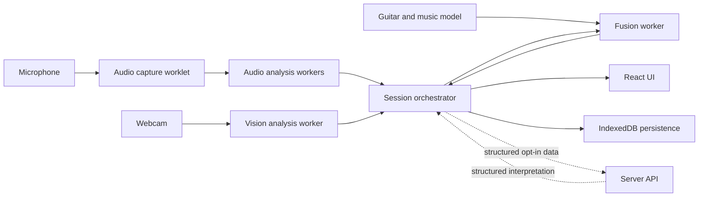

# StringSight Architecture and Contracts

Status: Accepted baseline  
Last updated: 2026-07-17  
Checklist parent: `BUILD_CHECKLIST.md`, item 3

## 1. Architectural objective

StringSight must process latency-sensitive audio, compute-intensive vision, deterministic music theory, and contextual fusion without allowing one workload to stall or redefine another. The architecture therefore centers on independent evidence producers, versioned contracts, a shared session timebase, and explicit orchestration.

The architecture optimizes for:

- Audio continuity over visual fidelity.
- Local processing over remote dependency.
- Reproducible fixture replay over hardware-only testing.
- Ranked evidence over forced answers.
- Measured fusion improvement over hidden post-processing.
- Replaceable algorithms behind stable subsystem boundaries.

## 2. System context

Raw microphone and webcam streams remain inside the browser. Only minimized structured events cross the optional remote boundary.

## 3. Subsystem boundaries

| Subsystem   | Owns                                                                                 | May depend on                                    | Must not own                      |
| ----------- | ------------------------------------------------------------------------------------ | ------------------------------------------------ | --------------------------------- |
| `app`       | Composition, routing, permissions UX, session orchestration, rendering               | Public contracts from all subsystems             | DSP, model inference, music rules |
| `audio`     | Capture adapters, PCM transport, onset, pitch, chroma, polyphonic and chord evidence | `shared`, deterministic helpers from `music`     | Vision state, UI, fused decisions |
| `vision`    | Camera adapters, fretboard geometry, fret indexing, hand landmarks and tracking      | `shared`, guitar geometry from `music`           | Audio labels, UI, fused decisions |
| `music`     | Pitches, intervals, chords, scales, tuning and virtual fretboard                     | `shared`                                         | Browser APIs, capture devices, UI |
| `fusion`    | Time alignment, evidence scoring, sequence inference and fallback                    | `shared`, `music`, public audio/vision contracts | Capture, rendering, persistence   |
| `shared`    | Schemas, timing, provenance, diagnostics, worker envelopes and errors                | No implementation subsystem                      | Product or algorithm behavior     |
| `workers`   | Worker entry points, validation, dispatch, transfer and cancellation adapters        | Public subsystem APIs and `shared`               | Algorithm definitions             |
| persistence | Session repositories, migrations, export/import                                      | `shared` contracts                               | Detection or fusion logic         |
| server API  | Secret-bearing OpenAI request boundary and response validation                       | Shared remote schemas when added                 | Raw continuous media by default   |

ESLint enforces the initial import direction. Item 3 defines contracts; later items add implementations behind them.

## 4. Thread and process ownership

| Execution context           | Responsibilities                                                                               | Forbidden work                                                        |
| --------------------------- | ---------------------------------------------------------------------------------------------- | --------------------------------------------------------------------- |
| Main thread                 | React rendering, permission flows, session orchestration, lightweight state projection         | FFT loops, model inference, frame-by-frame OpenCV, long serialization |
| `AudioWorklet` thread       | Copy or transfer PCM blocks, maintain minimal ring-buffer state, report capture diagnostics    | React state, network calls, heavy pitch or ML inference               |
| Audio analysis worker       | Onset, monophonic pitch, chroma and provisional audio candidates                               | Camera processing, UI rendering                                       |
| Polyphonic worker           | Basic Pitch model warmup and overlapping-window inference                                      | Live UI orchestration                                                 |
| Vision worker               | OpenCV, MediaPipe, fretboard geometry, hand position and temporal tracking                     | Audio analysis, remote calls                                          |
| Fusion worker               | Time joins, candidate enumeration, scoring and sequence optimization                           | Capture APIs, UI rendering                                            |
| Browser persistence context | IndexedDB transactions and migrations; may move to a worker if measured contention requires it | Signal processing                                                     |
| Server                      | OpenAI credentials, structured request/response validation, rate/error mapping                 | Storing or forwarding raw media by default                            |

Audio has scheduling priority. Under load, StringSight reduces video resolution or frame rate before reducing audio analysis quality.

## 5. Shared timebase

All persisted event times use monotonic milliseconds relative to one session origin.

1. The main thread creates a session origin from `performance.timeOrigin + performance.now()`.
2. Worker messages carry session-relative `issuedAtMs` timestamps.
3. Audio setup records an anchor containing `AudioContext.currentTime` and its corresponding session timestamp.
4. Audio sample times are mapped from that anchor rather than from wall-clock time.
5. Media timestamps are converted from microseconds into the session-relative timebase.
6. Wall-clock ISO timestamps are used only for human-facing session creation and update metadata.

This avoids dependence on `Date.now()` during capture and makes fixture replay deterministic. Implemented utilities live in `src/shared/time.ts`.

## 6. Contract model

Runtime contracts use Zod because worker messages, persisted sessions, imported fixtures, model outputs, and server responses cross trust or type-erasure boundaries.

### 6.1 Common requirements

Every prediction or fused inference contains:

- `schemaVersion`
- Stable `id`
- Session-relative timing
- Lifecycle: provisional, finalized, or corrected
- Ranked candidates
- Normalized confidence for each candidate
- Algorithm, version, run, subsystem and generation time provenance
- Bounded scalar diagnostics

### 6.2 Contract families

- `audio.ts`: note events, pitch candidates, chord events and chord candidates
- `vision.ts`: normalized points, fretboard geometry, fret ranges, alignment hypotheses and hand landmarks
- `fusion.ts`: guitar positions, guitar-state candidates and fused events
- `session.ts`: settings, corrections, event collections and persistence envelope
- `error.ts`: categorized recoverable application errors
- `worker.ts`: request, cancellation, progress, result, failure and cancellation acknowledgement envelopes

Public exports flow through `src/shared/index.ts`.

### 6.3 Confidence semantics

Confidence is always in `[0, 1]`, but it is not automatically comparable between algorithms. Each algorithm must document calibration. Raw algorithm scores remain separate and may be unbounded. Fusion must not treat an uncalibrated score as a probability.

### 6.4 Diagnostics semantics

Diagnostics are bounded scalar metadata intended for inspection and evaluation, such as window size, RMS, clarity, frame age or processing duration. They must not carry raw media, secrets, large arrays or arbitrary error objects.

## 7. Worker protocol

Each worker conversation uses protocol version 1 and a unique request ID.

### 7.1 Request lifecycle

1. Main thread sends a `request` envelope with operation, timestamp and validated metadata payload.
2. Large binary inputs travel in the structured-clone transfer list, not duplicated in diagnostics.
3. Worker may emit zero or more `progress` messages.
4. Worker emits exactly one terminal message: `result`, `failure`, or `cancelled`.
5. The orchestrator ignores late terminal messages for requests it has already finalized.

### 7.2 Cancellation

- Cancellation is cooperative and identified by `targetRequestId`.
- Main-thread callers use `AbortSignal`; adapters convert aborts into `cancel` envelopes.
- Workers check cancellation between bounded processing stages and before publishing results.
- A worker acknowledges cancellation with `cancelled`.
- Cancelling a provisional job must not invalidate already finalized events.
- Worker termination is reserved for unresponsive or corrupted workers and is surfaced as a recoverable processing error when restart is safe.

### 7.3 Initialization and model warmup

Initialization is an ordinary versioned request. Model-bearing workers report readiness and capability names only after assets are loaded and a minimal validation inference succeeds.

## 8. Error and recovery model

Errors cross boundaries as `AppError`, never as raw `Error` objects.

Each error includes:

- Stable category and code
- User-safe message
- Severity
- Owning subsystem
- Retryability
- Recommended user action
- Session-relative occurrence time
- Bounded diagnostic details

Error categories cover permission, device, unsupported capability, validation, model loading, processing, timeout, cancellation, storage, network, rate limiting and internal failure.

Recovery policy:

- Permission errors route to an explanation and browser-setting guidance.
- Device errors allow reselection without destroying the session.
- Vision processing failures disable or restart vision while preserving audio.
- Polyphonic-model failures retain provisional audio analysis.
- Fusion failures retain audio-only and visual evidence separately.
- Remote errors retain all local functionality.
- Validation and internal errors are recorded with enough diagnostics for fixture reproduction, without raw media or secrets.

## 9. Session and schema versioning

- Contract schema version 1 is the initial public boundary.
- Worker protocol version 1 evolves independently from persisted session schemas.
- Additive optional fields may remain within a schema version only when old readers remain correct.
- Renaming, removing, changing meaning, or changing requiredness requires a new schema version.
- Persistence changes require a migration fixture from every supported earlier version.
- Imported sessions are validated before migration and again after migration.
- Algorithm versions belong in provenance and do not require a schema version change unless shape or meaning changes.

## 10. Observability

Every worker job should eventually measure:

- Queue delay
- Processing duration
- Input duration or frame age
- Output candidate count
- Model or algorithm version
- Cancellation or fallback reason
- Relevant quality mode

Production diagnostics remain local unless the user explicitly shares them. Browser error reporting must exclude raw audio, frames, API keys, device labels where unnecessary, and session content.

## 11. Security and privacy boundaries

- Validate all worker, persistence, import and server boundary messages at runtime.
- Treat imported session bundles and model outputs as untrusted.
- Keep API keys exclusively on the server.
- Do not place raw media or unrestricted objects in error details or diagnostics.
- Transfer buffers when ownership can move; copy only when multiple consumers require independent ownership.
- Clear transferable buffers and worker state when a session is discarded.
- Keep remote analysis opt-in and show its structured payload before transmission.

## 12. Testing strategy for contracts

- Unit-test valid and invalid examples for every contract family.
- Test confidence bounds, time ordering, ranking and schema versions.
- Test clock mapping with injected deterministic clock sources.
- Test worker request, cancellation and terminal envelope validation.
- Maintain representative serialized session fixtures once persistence begins.
- Treat contract tests as compatibility tests; do not rewrite fixtures merely to make a breaking change pass.

## 13. Acceptance mapping

Checklist item 3 is complete when:

- Boundaries and allowed dependency directions are documented and linted.
- The shared monotonic timebase is implemented and tested.
- Audio, vision, fusion and session contracts compile and validate at runtime.
- Prediction contracts include confidence, provenance, timing and diagnostics.
- Worker request, result and cancellation envelopes are versioned and tested.
- Error categories and recovery semantics are documented and represented in code.
- Thread and server responsibilities are explicit.

## 14. Follow-on work

- Item 4 builds the evaluation corpus against these contracts.
- Item 5 introduces audio capture payloads and an `AudioWorklet` adapter.
- Item 10 implements the guitar-domain types behind the shared guitar-state contract.
- Items 11-15 add vision and fusion algorithms without changing the evidence ownership model.
- Item 18 adds migrations and serialized session fixtures.
