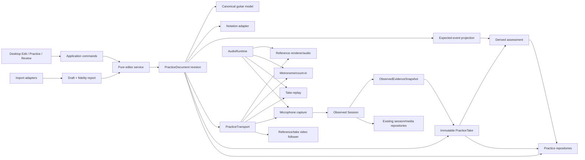

# Practice System architecture plan

- **Status:** Accepted invariant architecture; bounded hackathon technology profile accepted;
  pre-commercial gates retained
- **Updated:** 2026-07-20
- **Product authority:** `01-product-requirements.md` and the accepted D1-D10 record in
  `desktop-practice-product-decisions.md`
- **Decision record:** `../decisions/0006-practice-document-audio-runtime-and-notation-adapters.md`
- **Synchronization research:** `../research/practice-transport-and-timed-media-sync.md`
- **Disposable spike:** `11-notation-audio-video-feasibility-spike.md`
- **Post-spike decision:**
  `../decisions/0007-bounded-hackathon-practice-technology-profile.md`
- **Post-spike review:**
  `../verification/11-practice-post-spike-acceptance-independent-review.md`

## 1. Outcome and limits

Build a local-first, score-centered desktop Practice System where a guitarist can create or import
tablature, edit it through renderer-independent commands, practice any stable musical range under
one transport, record an immutable take, replay it, and optionally use synchronized reference/take
video. The same sources later support assessment without mutating authored intent or observed
evidence.

This invariant architecture is **Accepted**. ADR 0007 separately accepts a narrow hackathon
technology profile from the completed disposable spike: alphaTab 1.8.4 behind a replaceable adapter
for bounded notation/import, no alphaSynth or sound bank, fixture-backed import claims only,
optional/muted timed media, and Chrome on Windows 11 as the primary target. That decision does not
approve a schema, broad format fidelity, a codec/container/export path, exact take-video alignment,
Edge background/resume support, universal performance/storage budgets, or any placeholder UI as a
completed implementation. Production work proceeds in checklist dependency order.

The committed Practice Workspace is integration evidence only. Its score, transport, video, MIDI,
persistence, and assessment placeholders are not domain authority. The former rack presentation is
superseded; protected capture, analysis, evidence, correction, persistence, accessibility, and
failure-recovery behavior remains required.

## 2. Architectural invariants

1. `PracticeDocument` is authored intent; `Session` is observed evidence. Neither becomes the
   other through an implicit import, detector result, or UI edit.
2. Saved document revisions, observed-evidence snapshots, and `PracticeTake` records are immutable.
   Media availability and derived assessments have separate lifecycles.
3. `PracticeTransport` is the only command and musical-time authority. `AudioRuntime` is the only
   application-owned real-time audio render clock.
4. Notation, MIDI, synthesis, media elements, camera capture, encoders, React, and workers are
   subordinate adapters or observers. Their callbacks never advance transport or loop state.
5. Canonical musical positions are integer ticks independent of page, system, SVG/canvas geometry,
   MIDI PPQ, and detector milliseconds.
6. Third-party types/object graphs never enter canonical contracts, editor reducer state,
   persistence, or public worker protocols.
7. Reference video and take video are distinct optional media roles with distinct mappings.
8. Microphone/worklet audio remains authoritative take audio/evidence. Camera capture is video-only
   and optional.
9. Missing, stale, unsupported, evicted, or deleted media changes availability, not score/take
   identity.
10. Audio continuity and evidence preservation outrank notation animation, synthesis, video,
    encoding, and assessment work.

## 3. Context and dependency boundaries



| Boundary                                | Owns                                                                                                   | Must not own                                                    |
| --------------------------------------- | ------------------------------------------------------------------------------------------------------ | --------------------------------------------------------------- |
| Domain (`music`/future practice domain) | Guitar coordinates, score contracts, validation, tempo/meter math, edit commands, expected projections | Browser nodes, renderer graphs, UI state                        |
| Application                             | Use-case orchestration, command authorization, transactional finalization, view models                 | DSP, per-frame scheduling, canonical types from dependencies    |
| `AudioRuntime`                          | One context, buses, leases, generations, output diagnostics, sample-frame mapping                      | Documents, React state, detector meaning                        |
| `PracticeTransport`                     | Tick/phase/range/speed/loop state, serialized commands, render anchors                                 | Media decoding, renderer layout, persistence transactions       |
| Adapters                                | Canonical projection to/from notation, import/export, MIDI, synth, media, storage APIs                 | Canonical ownership, independent transport state                |
| Workers/worklet                         | Bounded DSP, analysis/import/alignment/encoding work and exact capture acknowledgements                | UI and cross-aggregate policy                                   |
| Persistence                             | Validation, transactions/intents, migrations, media state, identity verification                       | Detection, editor semantics, playback clocks                    |
| React UI                                | Semantic presentation, focus, user intent submission, snapshots                                        | Scheduling, transport mutations from callbacks, persisted truth |

## 4. Aggregate and identity model

### 4.1 Independent versioned contracts

Version separately:

- native StringSight document interchange;
- persisted `PracticeDocument` and immutable revision snapshot;
- `ObservedEvidenceSnapshot` and correction-prefix projection;
- `PracticeTake`;
- `ReferenceVideo`, `TakeVideo`, media assets, and mutable availability/tombstones;
- `ReferenceScoreMediaSyncMap` and `TakeCaptureMediaSyncMap`;
- `PracticeAssessment`;
- hash projection registry;
- worker/worklet and repository protocols; and
- every import/export adapter.

Cross-thread, import, persistence, and export boundaries use runtime validation. Validated internal
objects may avoid repeated validation in real-time loops.

### 4.2 `PracticeDocument`

The canonical document contains:

- stable document identity and monotonic revision identity;
- human metadata and import provenance/report;
- fixed schema PPQ 960, accepted by ADR 0009;
- duration and ordered tempo, meter, and key maps;
- guitar instrument configuration;
- tracks, voices, events/rests, string/fret positions, written pitch, rational tuplets, notated and
  sounding durations, ties/slurs/dynamics/articulations, and approved guitar techniques;
- named loop presets as explicit authored content; and
- qualified content and expected-event projection hashes.

Maps have a required tick-zero entry where applicable and strictly ordered unique ticks. Musical
ranges are half-open. Event/note IDs are stable across render passes. MIDI pitch is derived from the
canonical guitar position; it is not a competing writable truth.

The document excludes current selection/range, layout, panel state, focus/page/continuous view,
zoom, playhead, practice speed, current take/video, device, and transport state. Four bars per
system is presentation only.

### 4.3 Immutable revisions and hashes

Each durable save creates or identifies an immutable revision. Takes, assessments, and reference
sync maps bind the exact revision ID and a projection-qualified content hash. Undo/redo creates new
monotonic working revisions; it does not reuse an old identity.

Hash projections validate and materialize the exact schema, normalize declared strings, preserve
semantic array order, canonicalize declared sets/maps, serialize with an accepted versioned
canonical JSON algorithm, and hash UTF-8 bytes with SHA-256. The exact canonicalization, exclusion
sets, PPQ, golden bytes/digests, and migration policy remain contingent on final review; no
unqualified hex digest is accepted.

### 4.4 Observed evidence and corrections

The existing `Session` remains microphone evidence in session-relative milliseconds with raw
events, candidates, confidence, lifecycle, provenance, diagnostics, corrections, and optional PCM.
Monitoring creates no Session or retained recording PCM.

Finalizing a take creates an immutable `ObservedEvidenceSnapshot` at an exact raw-event and
append-only correction cutoff. It retains the validated Session projection, raw evidence hash,
correction-prefix identity, corrected projection hash, detector versions, recording metadata, and
optional expected PCM identity. Later correction/reanalysis creates a new snapshot relationship;
it never rewrites the old one.

### 4.5 `PracticeTake`

An immutable take binds:

- take ID, `practiceTakeCoreHash`, and creation metadata. The core-hash projection includes every
  immutable take field below but explicitly excludes any outward take-video sync-map link or
  mutable "current map" pointer;
- exact document/revision/content and expected-projection identity;
- selected half-open range and loop-pass policy;
- practice speed, metronome, count-in, and selected reference configuration;
- immutable evidence-snapshot/correction-cutoff identity;
- microphone recording media ID, format metadata hash, PCM envelope hash, and logical locator when
  finalized;
- every transport/capture epoch, discontinuity, sample rate, runtime/capture generation, and
  scheduled/applied frame observation;
- latency/calibration provenance and warnings; and
- optional take-video asset identity plus the captured timestamp/format provenance available when
  the take core is finalized.

Take status describes the immutable finalization outcome, not current media availability. Mutable
media state is resolved separately. Deleting/evicting/relinking bytes cannot mutate the take.

### 4.6 Mutable media availability

Each media asset has immutable identity/metadata/content hashes and separately mutable state such
as `available`, `external`, `missing`, `deleted-by-user`, `evicted`, `unsupported`, or `corrupt`.
Tombstone, relink, and purge operations increment state revisions and preserve provenance.
Hash-verified relink changes availability/location only.

An independently versioned `TakeVideoAttachmentState` selects the currently validated
`TakeCaptureMediaSyncMap`, if any. The map binds outward to `practiceTakeCoreHash` and the immutable
take-video content hash; the immutable take never contains the map hash. Re-alignment creates a new
immutable map and advances this attachment-state revision, avoiding circular content identity.

`ReferenceVideo` points to one reference asset and its revision-bound reference sync map.
`TakeVideo` belongs to one immutable take/capture and its take-capture map. Neither is embedded as a
blob in the score or evidence aggregate.

### 4.7 `PracticeAssessment`

Assessment is a versioned derived artifact binding an immutable score projection and take/evidence
snapshot. It preserves expected, observed, unmatched, ambiguous, correction, algorithm/version,
confidence, and alignment provenance. It can become stale or be replaced, but cannot mutate any
source.

## 5. Canonical guitar model

Implement the checklist's guitar model before practice contracts depend on it. It owns:

- explicit string numbers, ordered tuning, fret bounds, capo, scale length, and handedness;
- string/fret to absolute pitch and pitch-class mapping;
- possible-position and collision-free voicing enumeration;
- suggested fingering candidates and transition-cost policy; and
- validation of duplicated strings, impossible pitches, invalid capo/frets, and pitch mismatch.

String 1 is the conventional highest-pitched full-length string. Tab fret 0 is relative to capo:

```text
soundingMidi = openStringMidi + capoFret + tabFret
physicalFret = capoFret + tabFret
```

Handedness affects geometry/presentation, not pitch. Existing low-to-high tuning arrays and session
guitar-position types require explicit adapters and invariance tests; array order is never inferred.

## 6. Editor, notation, import, MIDI, and reference adapters

### 6.1 Editor command core

A pure service accepts discriminated, validated commands for events/rests, positions, duration,
voices, bars, tempo/meter/key, tuning/capo, techniques, metadata, loop presets, paste/transpose/
quantize, and accepted imports. A command/transaction either returns one valid document or
structured issues; no partial mutation escapes.

Undo/redo uses bounded canonical patches/snapshots, not renderer objects. Selection and focus use
stable semantic IDs. Native create/save/open and an ordinary HTML semantic score view work before a
notation renderer becomes required.

### 6.2 Notation adapter

The public adapter accepts canonical immutable input and produces:

- renderer input owned inside the adapter;
- stable event/tick-to-geometry mappings;
- render invalidation/results for focus, expanded, page, continuous, tab-only, and combined views;
- bounded diagnostic and capability data; and
- import draft/report output where the selected candidate provides import.

Renderer JSON/object graphs, layout coordinates, page/system counts, player state, and cursor events
never persist. UI editing always submits canonical commands. Renderer upgrades require golden
fixtures and cannot silently widen supported semantics.

### 6.3 Import/export

Native StringSight interchange is the only lossless editable round trip. Every other import enters
a temporary `PracticeImportDraft + ImportReport` with source version, adapter version, preserved,
converted, approximated, dropped, unsupported, blocking, quantization, guitar-position, and
security/resource findings. Cancel leaves the current document unchanged.

The accepted v1 product profile requires pitch/key, ties, slurs, common tuplets, two voices,
dynamics, core articulations, per-string sounding duration, hammer-on, pull-off, slide, bounded
bend, vibrato, let ring, palm mute, dead note, and natural harmonic. Grace notes and structural
repeats/endings require explicit conversion/expansion reports. Each format/technique direction gets
preserve/convert/reject/report fixtures and stable codes before advertising support.

### 6.4 MIDI boundary

Raw SMF preflight inventories every header/track event with byte location, absolute source tick,
event kind, and disposition: consumed, preserved, ignored-by-policy, unsupported, or malformed.
A declared reviewed parser or bounded StringSight preflight reader supplies this inventory; an
undeclared transitive parser is not acceptable.

SMF PPQ, tempo, meter, note, duration, velocity, and supported metadata convert into canonical
ticks/maps with quantified error. Guitar string/fret, capo, tuning, spelling, voices, notation,
techniques, repeats, and layout loss is explicit. Fingering candidates remain suggestions until
accepted. Authored document MIDI import/export and existing observed-session MIDI export are
separate adapters and user promises.

MIDI files and alphaSynth never own a runtime clock. Authored MIDI/reference events project from an
immutable document and schedule beneath `PracticeTransport`/`AudioRuntime`.

### 6.5 Accepted hackathon adapter profile

Use alphaTab 1.8.4 behind notation/import adapters without making its graph canonical. Initialize
it with player mode disabled and no soundfont. Accept only the exact fixture-backed semantics in ADR
0007: GP8 basic is the strongest bounded path; broad MusicXML D4 and the tested GP7 effects path are
rejected; GP5 effects are parsing-only/approximate; raw SMF support is limited to the declared
Type-1 and 960-to-480 PPQ cases with explicit loss. Import preflight and loss reporting remain
mandatory.

Omit alphaSynth and synthesized reference playback from the initial hackathon release. A future
renderer, importer, or synthesis candidate remains replaceable and must be re-evaluated within the
same canonical/adapter and single-authority boundaries. Two clocks or a private output API are not
a fallback.

## 7. `AudioRuntime`

One lazy application-scoped runtime owns:

- one interactive `AudioContext`;
- master safety/limiter stage;
- independently controlled reference, reference-video audio, metronome, count-in, take-replay, and
  silent capture buses;
- typed client leases and generation IDs;
- runtime/context state recovery and deliberate reset/disposal;
- output-device/sample-rate/base/output latency and `getOutputTimestamp` observations; and
- context-second, absolute-frame, performance-time, and capture-anchor services.

Disconnecting/switching microphone input releases capture-owned tracks/nodes without closing
playback clients or the context. Output buses cannot enter the software microphone graph. Gains use
bounded ramps and every scheduled command carries a generation. React/timers do not schedule sound.

The existing capture implementation currently creates/closes its own context. Production refactor
comes only after final acceptance and must retain every protected connection/record/pause/resume/
stop/replay/device-loss/duration-limit behavior and test.

## 8. `PracticeTransport` and synchronization

The non-React transport serializes load, prepare, play, pause, resume, stop, seek, speed, active
range, loop, count-in, replay, and unsynchronized-media-preview commands. State includes loaded
revision/hash, rational tick, phase, generation, range, speed, loop pass, tempo/meter projection,
runtime anchor, optional separate media-preview PTS, and failure/recovery status. Runtime anchors
persist rational sub-ticks as an exact numerator/denominator pair so pause, resume, or speed changes
between integer ticks do not jump.

Every discontinuous command cancels old scheduled work and increments a generation according to
the accepted command protocol. Audible events, clicks, capture boundaries, cursor, notation,
reference media, and take media derive from transport snapshots/anchors. A stale callback can only
report a diagnostic.

Tempo/meter mapping, exact capture epochs, Session mapping, MIDI timing, reference/take media maps,
media-follower state/correction, reference-video audio, timestamp alternatives, and measurement
obligations are normative in `../research/practice-transport-and-timed-media-sync.md`.

### 8.1 Metronome, count-in, loops, and recording

- Clicks derive from canonical tempo/meter/grouping and schedule on the runtime clock.
- Count-in is a synthetic phase, not negative score content. Arbitrary mid-bar/off-grid starts are
  represented honestly; no implicit snapping. The authoritative score tick remains fixed at the
  requested start tick while synthetic count-in phase/click positions advance on a separate virtual
  pre-roll timeline.
- Exact count-in pre-roll/Session-zero mechanics remain a post-spike owner decision. The candidate
  records pre-roll to protect the first attack and persists a separate score-start epoch.
- Loop range is half-open and layout-independent. Boundary cleanup prevents missing/doubled attacks,
  stuck notes, or release tails leaking into the next generation.
- Recording fixes a durable revision/range/settings before accepting evidence. Pause excludes wall
  time from logical frames while monitoring remains bounded. Finalize preserves the last valid take
  on recoverable failure.
- Audible take replay is a real-time transport client distinct from deterministic analyzer replay.

## 9. Timed-media model

### 9.1 Reference media

`ReferenceScoreMediaSyncMap` binds exact document revision/hash and media identity/hash. Ordered
anchors create validated piecewise mappings with explicit introductions, pauses, cuts, rubato,
gaps, boundary ownership, inverse behavior, stale detection, immutable history, and rebase/re-author
provenance. It never silently retargets after an edit.

### 9.2 Take media

`TakeCaptureMediaSyncMap` binds take-video PTS/camera timestamps to capture observations,
audio-context/logical frames, capture/transport generations, and one immutable
`practiceTakeCoreHash`. Its score relationship is derived through persisted epochs. It records
timestamp strategy and uncertainty. Finalization is acyclic: finalize/hash the take core, finalize/
hash the video asset, create a map that binds both hashes, then select it through mutable
`TakeVideoAttachmentState`. It is not interchangeable with a hand-authored reference map.

### 9.3 Media follower and audio policy

A non-React follower prepares, seeks, follows, pauses, stalls, recovers, degrades, fails, and
disposes subordinate to transport. It compares observed and target PTS at the same performance-time
coordinate, derives the nominal media rate from the local score-to-media mapping and current
tick/output-second rate, and then uses bounded rate correction/hysteresis, hard-seek rules, and old-
generation cancellation. Thresholds are accepted only after measurement. Optional-video failure
does not pause/corrupt P0 unless an explicit future video-required mode is selected.

Mapless media can enter an explicit `unsynchronized-media-preview` transport phase. The transport
remains the sole command authority for enter, play, pause, media seek, stop, and exit, while the
authoritative score tick is frozen at the entry tick and a separate opaque media-preview PTS moves.
The UI must label the score cursor as not synchronized. Loops, metronome, count-in, capture,
assessment, and reference/take alignment claims are disabled for this phase. Enter/exit increments
the generation and rejects stale callbacks; exiting restores the frozen score tick. This is preview,
not a score/media mapping or a second transport.

Reference-video audio is muted or omitted in the initial profile. A later accepted path is one
explicit reference source with gain/mute/solo under the runtime; the spike did not establish its
isolation, device lifecycle, or pitch quality. Take-video embedded audio is muted/excluded by
default. Camera capture requests `audio: false`; the bounded privacy fixture verified a finalized
container with one video track and no audio track.

Synchronized local review is independent of later downloadable mux/export. Export container and
codec are not selected here.

## 10. Threads, resources, and degradation

| Context                                | Work                                                               | Prohibited                                                  |
| -------------------------------------- | ------------------------------------------------------------------ | ----------------------------------------------------------- |
| Audio render/worklet                   | Bounded capture/meter transport, exact boundary application        | Storage, rendering, ML, network, allocations per quantum    |
| Audio analysis workers                 | Existing onset/pitch/chroma/Basic Pitch and finalization           | UI/media control                                            |
| Import/notation worker where supported | Capped parse/conversion/render preparation                         | Canonical mutation outside commands                         |
| Media/encoding worker where supported  | Frame observation, encode/mux experiment, container inspection     | Transport authority, microphone evidence                    |
| Alignment worker later                 | Expected/observed projection and assessment                        | Source mutation                                             |
| Main thread                            | Permissions, adapter orchestration, semantic UI, bounded snapshots | DSP, per-frame authoritative scheduling, long serialization |
| Storage boundary                       | Validation, transactions/intents, hashes, migration/recovery       | Playback/detection decisions                                |

Under load: drop/coarsen UI animation and video observation first; reduce optional video resolution/
frame rate or stop encoding next; defer notation rerender/import/assessment; preserve audio render,
capture transport, evidence continuity, and explicit discontinuity reporting. No degradation invents
continuity or silently lowers detector semantics.

## 11. Persistence and media lifecycle

Extend the existing validated IndexedDB approach only after acceptance. Repositories cover current
documents, immutable referenced revisions, evidence snapshots, takes, assessments, maps, media
metadata/state, and durable operation intents. Existing Session/PCM stores remain source boundaries
until a reviewed migration.

Requirements:

- explicit schema/database versions and migration fixtures from every supported version;
- atomic same-database writes or idempotent durable two-phase intents across boundaries;
- strict identity/hash validation and no reused ID with different content;
- media finalize/resolve/inspect/tombstone/purge/relink/reference-list operations;
- a durable tombstone before byte purge so missing bytes are never reported available;
- quota, blocked upgrade, interruption, corruption, multi-tab, eviction, and missing-media recovery;
- native bundle manifests listing included, external, omitted, missing, deleted, and unsupported
  media; private PCM/video opt-in by accepted D9; and
- previewed deletion with no silent cascades.

Accepted product retention: deleting a document head retains referenced revisions as archived;
deleting a mutable Session retains take-referenced structured evidence; PCM/video is asked
separately; media deletion retains identity/tombstone but removes replay; deleting a take removes
only exclusive derived/snapshot data after preview; `Delete everything related` is separate and
fully enumerated.

## 12. Accessibility and test seams

- Canonical validation, edit commands, tempo/map functions, media maps, follower correction, and
  persistence policies are pure/testable without React, hardware, renderer, or media element.
- Adapters use deterministic fixtures and injectable ports/clocks/elements. Runtime/transport use
  fake audio frames and serialized-command race tests.
- Score inspection/editing has ordinary semantic HTML organized by track, measure, beat, event,
  string, fret, technique, and duration; glyph focus is never required.
- All commands are keyboard operable; composite navigation uses predictable focus; drag has key and
  direct-value alternatives; selection/focus/playhead/evidence/assessment differ non-visually.
- Status changes are announced without beat/analyzer flooding. Reduced motion, contrast, target
  size, 200% zoom, resizable desktop composition, and focus restoration remain release gates.
- Errors and unavailable/stale states expose reason, preservation, and actionable recovery.

## 13. Product-decision cross-check

| Decision                         | Architecture consequence                                                                           |
| -------------------------------- | -------------------------------------------------------------------------------------------------- |
| D1 complete P0                   | Score/editor/transport/audio take/replay/persistence are independent of video and assessment       |
| D2 gated video                   | Timed media is P1, separately gated, and has an audio-only degradation path                        |
| D3 guitar-first entry            | Native/New/Open/Import are primary; MIDI is explicit performance-to-draft conversion               |
| D4 technique breadth             | Canonical schema and adapter fixtures cover each accepted row; no opaque escape hatch              |
| D5 one document/library rail     | Domain models one active workspace; no document-tab transport semantics                            |
| D6 progressive analysis          | Existing rich evidence remains available behind view models; diagnostics do not become score state |
| D7 take review before assessment | Immutable take/evidence identity and take-only/A-B replay precede alignment                        |
| D8 video audio                   | Reference-video audio is optional reference output; embedded take audio is ignored as evidence     |
| D9 retention/export              | Mutable availability/tombstones, previewed deletion, structured default, private media opt-in      |
| D10 deferred intelligence        | Live vision/fusion/GPT are outside this architecture's P0/P1 implementation order                  |

## 14. Implementation sequence after bounded acceptance

1. Accepted architecture and bounded hackathon technology/license profile (complete).
2. Canonical guitar model (complete).
3. Versioned practice contracts, hashes, maps, and golden fixtures (next).
4. Renderer-independent editor and native round trip.
5. Accepted notation/import and authored-MIDI adapters.
6. Shared `AudioRuntime` with protected capture regression/hardware verification.
7. `PracticeTransport`, reference playback, metronome, count-in, loops, and capture epochs.
8. Optional timed-media runtime if its gate passes.
9. Persistence/migrations/media lifecycle.
10. Replace production workspace placeholders in dependency order.
11. Practice-take recording/review and coordinated A/B.
12. Assessment only after alignment fixtures pass.
13. Optional live vision/fusion/GPT only through later gates.
14. Release hardening.

Each stage still satisfies its own implementation, test, accessibility, performance, and release
gates. Architecture acceptance does not make the current score, transport, import, MIDI, video, or
assessment placeholders functional.

## 15. Accepted decisions and retained gates

Architecture alternatives already disqualified because they violate accepted invariants:

- authored score fields inside mutable `Session`;
- persisting a renderer/player graph;
- an independent notation, media, recorder, React, or Tone.js transport;
- capture-owned context lifecycle after shared runtime;
- one ambiguous sync map for reference and take video;
- camera/embedded audio as silent evidence replacement;
- raw recorder chunk delivery time claimed as exact frame sync;
- silent media retarget/relink/deletion cascade; and
- video failure that weakens ordinary P0 audio/tab/take work.

ADR 0007 records the accepted alphaTab/MPL profile, synthesis omission, import/SMF limits, optional
video policy, primary browser target, and budget posture. Exact PPQ/hash/schema details, count-in
capture mapping, database mechanics, codec/container/export strategy, a reference-video audio path,
and numeric budgets remain decisions for their implementing checklist items.

## 16. Post-spike acceptance boundary

The disposable spike's full commercial-quality exit criterion was not met. The retained report
separates bounded passes from failed and inconclusive claims. Architecture acceptance rests on the
coherence of the invariant model plus the bounded implementation/fallback decisions, not on a claim
that one application-wide runtime, broad imports, exact physical A/V sync, Edge lifecycle recovery,
full accessibility, representative hardware, repeated soaks, or percentile budgets passed.

The next production item is the versioned Practice System contracts, hashes, maps, and golden
fixtures. The disposable spike worktrees remain evidence sources and are never merged wholesale.
