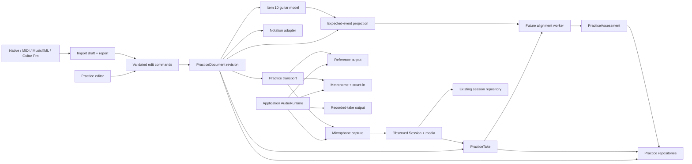

# Practice System architecture plan

- **Status:** Proposed for architecture review
- **Last updated:** 2026-07-19
- **Checklist relationship:** Extends Item 10 and introduces the authored-practice workflow that
  precedes later performance assessment
- **Decision record:** `docs/decisions/0006-practice-document-audio-runtime-and-notation-adapters.md`

## 1. Outcome

Build a production-grade practice subsystem in which a guitarist can author or import tablature,
edit it without losing musical meaning, play a whole score or a selected range, loop any valid
musical range, change practice speed, use a reliable metronome and count-in, record a take, and
compare the take with the reference. The same foundations must later support timing and pitch
assessment without rewriting the editor, transport, or capture stack.

This work is not a second application beside StringSight. It adds authored musical intent to the
existing local-first evidence pipeline:

- `PracticeDocument` is what the guitarist intends to play.
- `Session` remains what StringSight observed from the microphone.
- `PracticeTake` records exactly how one immutable document revision was practiced.
- `PracticeAssessment` is a reproducible, derived comparison between expected and observed events.

The plan preserves the accepted architecture: runtime validation at boundaries, independent
domain evidence, worker isolation, one monotonic session clock, local-first storage, and a React
UI that does not own DSP or timing.

## 2. Current baseline and required changes

The current repository already provides:

- Versioned Zod contracts and branded session-relative timestamps.
- `AudioContext` anchoring helpers in `src/shared/time.ts`.
- Microphone capture through an `AudioWorklet`, transport worker, bounded diagnostics, recording,
  pause/resume, and deterministic analyzer replay.
- Separate monophonic and polyphonic analysis workers.
- An immutable observed `Session`, append-only corrections, JSON interchange, and conditional MIDI
  export.
- Atomic session/media persistence in IndexedDB.
- A domain-neutral rack shell with ordinary accessible HTML controls.

The current `MicrophoneCapture` creates and closes its own `AudioContext`. Its replay path emits PCM
to analyzers using timer pacing and does not produce audible A/B playback. The current MIDI export
uses one tick per millisecond with a fixed 60 BPM tempo and exports observed finalized notes only.
It is valid evidence interchange, but it is not an editable score, tempo map, measure model, or
guitar-tab file.

The Practice System therefore needs new authored-score, playback, and persistence boundaries. It
must not overload `Session` or reinterpret the existing MIDI exporter as a sequencer.

## 3. Architectural principles

1. **Authored intent and observed evidence are different aggregates.** A detector result never
   silently becomes an authored score, and score edits never rewrite recorded evidence.
2. **One application-owned audio rendering clock is authoritative.** Reference playback,
   metronome, count-in, audible take replay, capture anchors, and transport projection share one
   `AudioContext` whenever the platform permits.
3. **Musical time is integer tick time.** Persisted score positions are never milliseconds.
4. **External libraries are adapters.** No third-party object graph is the stored document or the
   reducer state.
5. **File import is a report-producing conversion.** Loss and ambiguity are explicit before the
   user accepts an imported draft.
6. **The virtual guitar model is foundational.** String/fret validity and pitch mapping do not live
   in the renderer or UI.
7. **Transport is independent of React.** React observes snapshots and submits commands; it does
   not schedule audio.
8. **Assessment is downstream.** Recording and alignment use immutable score and take references;
   scoring cannot feed back into source evidence.

## 4. System context



## 5. Aggregate and contract model

### 5.1 Independent schema versions

Do not reuse the global `CONTRACT_SCHEMA_VERSION` as the only practice-file version. Define
independent constants for:

- Native practice interchange format.
- Persisted `PracticeDocument` schema.
- `PracticeTake` schema.
- `PracticeAssessment` schema.
- Recording-media metadata and mutable-state schemas.
- Canonical hash-projection registry, including authored-tempo and resolved-count-in projections.
- Practice worker protocols.
- Each import/export adapter version.

Cross-thread, persistence, and import boundaries use Zod. Tight render/scheduler loops use already
validated internal values.

### 5.2 `PracticeDocument`

`PracticeDocument` is the only lossless editable source of truth. Its initial conceptual shape is:

```text
PracticeDocument
  schemaVersion
  id
  revision                       monotonic; never reused after undo
  createdAt / updatedAt          human-facing wall-clock metadata
  title / artist / notes
  ticksPerQuarter = 960          fixed for schema v1
  durationTicks
  instrument                     canonical guitar configuration
  tempoMap[]                     ordered tick + integer microsecondsPerQuarter
  meterMap[]                     ordered tick + canonicalMeterOriginTick
                                 + numerator + denominator + grouping
  keyMap[]                       ordered tick + written key signature
  tracks[]                       one guitar track initially; model permits extension
    voices[]
      events[]
        id
        startTick
        durationTicks
        tuplet ratio, when present
        kind                     sounded event or explicit rest
        positions[]              note id + string + fret + written pitch
                                 sounding duration + velocity + tie + techniques
  loopPresets[]                  named half-open tick ranges
  provenance                    native/import origin and adapter version
```

Schema-v1 invariants:

- `ticksPerQuarter` is exactly 960. This is divisible by common binary subdivisions and triplets
  and avoids floating-point score positions. An importer reports any source time that cannot be
  represented exactly after normalization.
- Map entries are strictly ordered and unique by tick. Tempo and meter have entries at tick zero.
  Each meter entry persists `canonicalMeterOriginTick`, the downbeat-phase origin for its segment;
  schema v1 requires it to equal that meter entry's tick because meter changes occur at bar
  boundaries. It is never inferred from the user's selected practice range.
- `microsecondsPerQuarter` is a positive bounded integer and the only authored tempo truth. UI BPM
  is derived; editor BPM input must map exactly to the integer or disclose/confirm its quantified
  normalization. The initial displayed range is 20-400 quarter notes per minute.
- Meter denominators are powers of two. Meter changes initially occur at bar boundaries.
- Event IDs and note IDs are stable across render passes.
- Event tick ranges are half-open `[startTick, endTick)` and remain inside document duration.
- A voice cannot contain overlapping sounded events unless the representation explicitly groups
  the notes as one simultaneous event.
- One simultaneous guitar event cannot use a string more than once.
- MIDI pitch is derived from the guitar model. It is not a second writable truth beside string and
  fret.
- UI layout, current selection, zoom, open panel, playback position, and current practice speed
  are not part of the score. Named loop presets are document content; the active loop is workspace
  state.

The bar grid is derived from `meterMap` and `durationTicks`, avoiding duplicated measure timing.
Pickup bars need an explicit future schema field before they are supported; they must not be
simulated with malformed first-bar duration.

### 5.3 `Session`

The existing `Session` remains observed evidence with session-relative milliseconds, detector
events, corrections, provenance, and optional captured PCM. Practice work may extend capture
metadata or add a link record, but must not add authored measures, tempo maps, loops, or editor
history to `Session`.

### 5.4 `PracticeTake`

A take is a relation and reproducibility record, not a media blob:

```text
PracticeTake
  schemaVersion
  id
  practiceDocumentId
  practiceDocumentRevision
  practiceDocumentContentHash
  observedEvidenceSnapshotId
  observedEvidenceSnapshotHash
  sourceSessionId
  detectorEvidenceHash
  correctionCutoff
    correctionCount
    correctionPrefixHash
    lastCorrectionId
  projectedCorrectionHash
  recordingMediaIdentity, when PCM was finalized
    mediaId                    immutable globally unique identity
    mediaLocator
      repositoryId = audio-session-media/v1
      objectKey = mediaId      stable logical locator, not a physical IndexedDB store name
    metadataSchema = recording-media-metadata/v1
    metadataHash               qualified recording-media-metadata projection hash
    pcmEnvelopeHash            immutable hash of the finalized PCM envelope
  createdAt
  selectedRangeTicks
  authoredTempoMapHash         qualified authored-tempo-map projection hash
  speedMultiplier
  metronome configuration
  countIn configuration
  resolvedCountInScheduleHash  qualified resolved-count-in-schedule projection hash
  transport start/stop anchors
  input/output latency observations and calibration version
  capture/audio-runtime diagnostic snapshot
  status                       immutable finalization outcome; never media availability
```

`PracticeTake` does not point only at a mutable session head. Finalizing a take creates an immutable
`ObservedEvidenceSnapshot` containing the validated structured `Session` at a precise correction
cutoff. It binds:

- The raw detector-event sequence and provenance hash.
- The append-only correction prefix by count, last ID, and prefix hash.
- The projected corrected view hash produced from that exact prefix.
- Recording metadata and, when finalized, a stable media ID, logical repository locator, and
  separate PCM-envelope hash.
- The source session ID for navigation, without depending on that session remaining unchanged.

Later corrections, session replay, re-analysis, title changes, deletion of the mutable session
head, PCM eviction, or a media tombstone cannot change the take or its media identity/hash. A user
who wants an assessment with newer corrections creates a new evidence snapshot and assessment
revision; the original remains reproducible.

Media availability is deliberately **not** embedded in immutable `PracticeTake`. The media
repository owns a separately versioned mutable `RecordingMediaState` keyed by `mediaId`:

```text
RecordingMediaState
  schema = recording-media-state/v1
  mediaId
  expectedPcmEnvelopeHash
  state = available | external-only | deleted-by-user | evicted | missing | corrupt
  stateRevision
  verifiedAt, when verified
  tombstoneAt / tombstoneReason, when unavailable by policy
  replacementLocator, only after an explicit hash-verified relink
```

The take resolver returns immutable identity and current availability as separate values. Relink is
allowed only when the candidate bytes reproduce `pcmEnvelopeHash`; it changes repository state, not
the take. UI and exports must never rewrite an immutable take from `available` to
`deleted-by-user`. They announce the state transition, disable take replay/A/B controls, retain the
expected media hash, and distinguish deliberate deletion, storage eviction, missing bytes, and
hash corruption.

The referenced document revision and observed-evidence snapshot are immutable and retained while a
take references them. Exported take bundles include both exact structured snapshots and a manifest
of every hash. PCM has three explicit export states: `included`, `external-reference`, or `omitted`.
This export-manifest state describes that bundle; it is not repository availability and does not
mutate the take. An omitted recording keeps its immutable media ID, locator, metadata/hash, and
PCM-envelope hash in the manifest and clearly disables portable A/B replay; it must not be
described as a complete media bundle.

**Recommended export default, pending owner approval:** include the document revision, take,
structured observed evidence, and assessments; exclude PCM unless the user selects “Include my
recording.” This minimizes private media exposure and bundle size, but an exported bundle cannot
replay the take without separately supplied media. Alternatives are always include PCM (most
reproducible, largest and least private) or ask on every export (most explicit, more interaction).
The existing `Session` repository continues to own live observed media; immutable evidence
snapshots own their structured copy.

### 5.5 `PracticeAssessment`

Assessment is added only after recording and A/B playback are reliable:

```text
PracticeAssessment
  schemaVersion
  id
  takeId
  practiceDocumentContentHash
  sessionEvidenceHash
  algorithm / version / options
  generatedAt
  alignment anchors and confidence
  expected events
  matched / missed / extra observed events
  timing, pitch, chord, and sustain metrics
  per-event confidence and ambiguity
  aggregate summaries
```

Assessments are replaceable derived artifacts. They never mutate the source document, take, or
session. A new algorithm produces a new assessment record.

### 5.6 Canonical serialization and content hashes

Every persisted or exported binding stores an algorithm-and-projection-qualified hash, never an
unversioned hex string. The generic whole-object projection uses:

```text
hash identifier: sha256:jcs-v1:<lowercase hexadecimal digest>
digest input: UTF-8 bytes of RFC 8785 JSON Canonicalization Scheme output
digest: SHA-256 through Web Crypto or a byte-equivalent tested implementation
```

Every specialized projection extends that identifier as
`sha256:<projection-id>:<lowercase hexadecimal digest>`. Projection IDs are versioned independently
from persisted schemas. All JCS-v1 projections follow these rules:

1. Parse and validate the exact schema version; do not hash an unvalidated JavaScript object.
2. Materialize schema defaults and normalize schema-defined strings to Unicode NFC. Reject lone
   surrogates, non-finite numbers, negative zero, and values outside schema bounds.
3. Preserve semantically ordered arrays. Before serialization, sort only fields whose schema calls
   them sets/maps, using their documented stable key; reject duplicate keys rather than relying on
   input order. Event, voice, tempo, meter, correction, and candidate order remain semantic.
4. Serialize with RFC 8785 property ordering and number/string rules.
5. Hash the resulting UTF-8 bytes.

The take fields that previously looked like informal labels are normative contracts:

| Take field                            | Validated projection schema                                                                                                                                                                                                                                                                                                                | Qualified hash identifier                        | Ordering and exclusions                                                                                                                                                                                                                                               |
| ------------------------------------- | ------------------------------------------------------------------------------------------------------------------------------------------------------------------------------------------------------------------------------------------------------------------------------------------------------------------------------------------ | ------------------------------------------------ | --------------------------------------------------------------------------------------------------------------------------------------------------------------------------------------------------------------------------------------------------------------------- |
| `recordingMediaIdentity.metadataHash` | `recording-media-metadata/v1`: exactly `schema`, `sampleRateHz`, `channelCount`, `sampleEncoding = f32le`, and `frameCount`. Channel order is the PCM-envelope order.                                                                                                                                                                      | `sha256:recording-media-metadata-jcs-v1:<hex>`   | Fixed fields only. Excludes `mediaId`, locator/store names, availability/tombstone state, wall-clock times, file name, MIME label, and the hash field.                                                                                                                |
| `authoredTempoMapHash`                | `authored-tempo-map/v1`: exactly `schema`, document `ppq`, and the authored tempo events as integer `tick` plus integer `microsecondsPerQuarter`; BPM input is normalized to that exact integer or rejected with a quantization report.                                                                                                    | `sha256:authored-tempo-map-jcs-v1:<hex>`         | Events are strictly ascending by tick and unique; input order is rejected if noncanonical. Excludes document ID/revision/title, meter/key maps, playback speed, derived seconds/frames, provenance, and hash field.                                                   |
| `resolvedCountInScheduleHash`         | `resolved-count-in-schedule/v1`: exactly `schema`, `ppq`, requested start tick, meter origin, requested bar count, destination tempo/meter/grouping, synthetic start/duration and leading/trailing partial ticks, sample rate, score-start context frame, and every resolved click's virtual grid tick, role, and scheduled context frame. | `sha256:resolved-count-in-schedule-jcs-v1:<hex>` | Grouping order is semantic. Clicks are strictly chronological by scheduled frame, then virtual grid tick; duplicate frame/tick entries are rejected. Excludes take/document IDs, UI labels, wall-clock times, volume/sample choice, repository state, and hash field. |

These three golden fixtures are normative UTF-8 JCS bytes, followed by the required qualified
digest. Implementations must reproduce them in browser and Node tests before persistence ships:

```text
{"channelCount":1,"frameCount":48000,"sampleEncoding":"f32le","sampleRateHz":48000,"schema":"recording-media-metadata/v1"}
sha256:recording-media-metadata-jcs-v1:6a8cedda37279d0048d9984c9ad3c92e65a9295b30a71d7a536bbc602e1399ef

{"events":[{"microsecondsPerQuarter":500000,"tick":0},{"microsecondsPerQuarter":400000,"tick":1920}],"ppq":960,"schema":"authored-tempo-map/v1"}
sha256:authored-tempo-map-jcs-v1:c72378fa90e5fac169b751e2f9669f8b18d5e81e1733e9d0e6bac22e2545b259

{"barCount":1,"clicks":[{"role":"ordinary","scheduledContextFrame":156000,"virtualGridTick":-960},{"role":"downbeat","scheduledContextFrame":180000,"virtualGridTick":0},{"role":"ordinary","scheduledContextFrame":204000,"virtualGridTick":960},{"role":"ordinary","scheduledContextFrame":228000,"virtualGridTick":1920}],"countInDurationTicks":3840,"countInStartVirtualTick":-1440,"destinationMeter":{"denominator":4,"grouping":[4],"numerator":4},"destinationTempoMicrosecondsPerQuarter":500000,"leadingPartialTicks":480,"meterOriginTick":0,"ppq":960,"requestedStartTick":2400,"sampleRateHz":48000,"schema":"resolved-count-in-schedule/v1","scoreStartContextFrame":240000,"trailingPartialTicks":480}
sha256:resolved-count-in-schedule-jcs-v1:fc082599d2e4a3dd03d647e1e012c463895440b37df8e6c870f460060cbda366
```

`PracticeDocumentContentHash` includes all validated document fields that can affect authored
identity, notation, playback, import provenance, title, or credits. It excludes `id`, `revision`,
`createdAt`, `updatedAt`, and the hash field itself. A separate `ExpectedEventProjectionHash`
excludes descriptive metadata and binds the exact score semantics used for assessment.

`ObservedEvidenceSnapshotHash` includes the structured session snapshot, raw events, provenance,
recording metadata, and the correction prefix at its cutoff, but excludes its own hash and storage
keys. `CorrectionPrefixHash` hashes the ordered first `correctionCount` corrections.
`ProjectedCorrectionHash` hashes the deterministic projection. PCM is not JSON-canonicalized: its
media hash covers a versioned byte envelope containing sample rate, channel count, frame count, and
little-endian IEEE-754 float samples; WAV export has a separate file hash.

Migration validates the stored hash using its recorded old projection/algorithm before conversion.
It preserves that value as `sourceHash`, records migration algorithm/version, produces the new
schema object, and computes a new qualified hash. A migration never silently relabels an old digest
as current. Hash-projection changes require a new identifier such as `jcs-v2`, golden fixtures, and
an ADR compatibility review.

## 6. Checklist Item 10: canonical guitar-domain model

Implement Item 10 as a prerequisite inside the Practice System milestone, in `music`, not inside
the editor or alphaTab adapter.

### 6.1 Instrument configuration

Represent:

- Stable instrument/configuration ID.
- Ordered strings with explicit string number and open MIDI pitch.
- String 1 as the highest-pitched full-length string, matching conventional tab and MusicXML.
- Fret count, scale length, handedness, capo fret, and tuning name.
- Optional per-string scale length later, without changing pitch mapping.

The current session tuning array is low-to-high while `GuitarPosition.string` is only constrained
to 1-6. The new model must provide explicit conversion adapters and tests; code must never infer
ordering from array position.

Tab fret numbers are relative to the capo: fret 0 means the capoed open string. Therefore:

```text
soundingMidi = openStringMidi + capoFret + tabFret
physicalFret = capoFret + tabFret
```

Both must remain inside configured bounds. Handedness affects geometry and presentation, not pitch.

### 6.2 Pure operations and tests

The guitar model provides pure functions to:

- Map every valid string/fret to absolute MIDI and pitch class.
- Enumerate all locations for a pitch.
- Enumerate collision-free voicings for a simultaneous pitch set.
- Rank suggested MIDI-import fingerings while preserving all candidates and transition costs.
- Generate adjacent state transitions and a documented physical transition cost.
- Validate tuning, capo, fret range, duplicated strings, impossible positions, and pitch mismatch.

Exhaustive tests cover all positions for standard and alternate tunings, round trips, capo
invariants, transposition invariants, left/right-handed pitch equivalence, chord voicing uniqueness,
and transition-cost symmetry/asymmetry where defined.

## 7. Notation and playback technology decision

### 7.1 Conditional alphaTab 1.8.4 selection

Evaluate pinned `@coderline/alphatab` 1.8.4 as the preferred engraving/import/playback candidate.
Its stable API exposes guitar tablature rendering, Guitar Pro and MusicXML import, MIDI generation,
SoundFont playback, cursor events, tick-based playback ranges, looping, playback speed,
metronome/count-in volume, workers, and AudioWorklet output. The official stable API documents
tick positions, tick-based playback ranges, looping, count-in, and metronome controls in
[IAlphaSynth](https://alphatab.net/docs/reference/types/synth/ialphasynth) and
[PlaybackRange](https://alphatab.net/docs/reference/types/synth/playbackrange).

This is conditional for two independent reasons:

1. The repository license policy does not currently approve MPL-2.0 production packages. alphaTab
   1.8.4 identifies itself as MPL-2.0 in its
   [tagged license](https://github.com/CoderLine/alphaTab/blob/v1.8.4/LICENSE). Owner approval and an
   amended license ADR/check are required before installation or production bundling.
2. alphaTab's Vite integration changes worker/AudioWorklet handling. Its official
   [Vite guide](https://alphatab.net/docs/getting-started/installation-vite/) says the plugin copies
   assets and configures both execution contexts, and warns of shared Vite worker configuration
   constraints. It must coexist with StringSight's existing workers and capture worklet before it
   is adopted.

### 7.2 Adapter boundary

alphaTab never becomes the persisted model or editor reducer state.

- `PracticeDocument -> AlphaTabScore` is a deterministic projection.
- `AlphaTabScore -> PracticeImportDraft` is an importer conversion with a fidelity report.
- Render geometry/cursor events are mapped back to stable StringSight event IDs.
- A render invalidation may rebuild the alphaTab graph; no UI command mutates the alphaTab graph as
  authoritative state.
- alphaTab types do not cross the adapter's public interface.
- Adapter fixture tests pin alphaTab 1.8.4 and fail visibly on upgrade.

This boundary is required because alphaTab's own low-level guide says its JSON/Map form is not a
stable persistence format across versions
([low-level API documentation](https://alphatab.net/docs/guides/lowlevel-apis/)).

### 7.3 `@tonejs/midi` role

Evaluate pinned `@tonejs/midi` 2.0.28 only as a Standard MIDI File parser/writer inside the MIDI
adapter. Its published API exposes PPQ, tick positions, tempos, time signatures, tracks, notes, and
encoding, and is MIT-licensed
([package documentation](https://www.npmjs.com/package/%40tonejs/midi)).

Do not add Tone.js as the transport, synth, metronome, clock owner, or general audio framework.
`@tonejs/midi` does not require using Tone.js. The canonical document and tempo-map utilities own
musical meaning; the package handles binary MIDI syntax.

### 7.4 Alternatives considered

| Candidate                       | Strength                                                             | Reason not selected as the primary path                                                                                                                                                                                                                                                                               |
| ------------------------------- | -------------------------------------------------------------------- | --------------------------------------------------------------------------------------------------------------------------------------------------------------------------------------------------------------------------------------------------------------------------------------------------------------------- |
| VexFlow                         | Mature MIT SVG/Canvas notation and tab renderer                      | Rendering primitive only; StringSight would own file import, semantic score graph, guitar effects, layout, playback, cursor mapping, and most engraving orchestration. [VexFlow describes itself as a rendering API](https://www.vexflow.com/).                                                                       |
| OpenSheetMusicDisplay           | BSD-3-Clause, MusicXML parsing and responsive display, including tab | Its own README says it is a renderer rather than a full interactive editor and that playback is not part of the normal open-source core. It does not solve Guitar Pro import, authored playback, or a guitar-first semantic layer. [OSMD repository](https://github.com/opensheetmusicdisplay/opensheetmusicdisplay). |
| Tone.js plus renderer           | Strong Web Audio scheduling and musical transport abstractions       | Adds a second broad audio framework and still leaves notation/import/editor semantics unsolved. It would compete with StringSight's application-owned runtime. [Tone.js describes its global transport and audio framework](https://tonejs.github.io/).                                                               |
| Fully custom renderer and synth | Maximum control and permissive ownership                             | Highest correctness and maintenance burden for engraving, file fidelity, guitar techniques, SoundFont synthesis, accessibility mapping, and browser audio behavior. Retained only as fallback for playback if alphaSynth cannot join the shared runtime.                                                              |

## 8. Import/export and fidelity policy

### 8.1 Native StringSight JSON

The versioned native format is the only lossless round-trip guarantee. Export includes the full
document, schema and adapter versions, content hash, and optional linked take/assessment manifest.
Import validates into a temporary object before replacing or creating local data.

### 8.2 Standard MIDI File

Standard MIDI files are time-stamped performance interchange, not a tablature document. The MIDI
Association states that SMF supports streams, tracks, tempo, and time-signature information and is
not intended to replace each application's normal file format
([SMF overview](https://midi.org/standard-midi-files)).

MIDI import preserves when representable:

- PPQ-normalized note onset/duration.
- Tempo and time-signature maps.
- Track name, channel, program, velocity, and supported metadata.

Before `@tonejs/midi` semantic conversion, a raw SMF preflight pass enumerates every header and
track event with byte range, track, absolute tick, status/meta type, and payload length. Each raw
event is reconciled to one import disposition: `consumed`, `preserved`, `ignored-by-policy`, or
`unsupported`. System Exclusive, sequencer-specific, unknown meta, controller, pitch-bend,
aftertouch, lyric/text, key-signature, marker, and malformed events therefore cannot disappear
solely because the high-level parser does not expose them. Unsupported and ignored events produce
stable, counted report entries; material timing or performance events require user acceptance.

The spike must prove a reviewed public raw parser can provide this inventory, either through a
directly declared lower-level dependency or a bounded StringSight preflight reader. Depending on a
transitive package without declaring/reviewing it is not accepted. If complete raw inspection
cannot be proven, the product must narrow its claim to the explicitly inspected SMF subset and show
one file-level warning that uninspected events may be omitted; it may not claim comprehensive loss
reporting.

MIDI import cannot inherently preserve:

- Guitar string/fret choice.
- Capo and tuning semantics.
- Guitar techniques, notation spelling, voices, beams, ties, repeats, layout, or loop presets.

The importer sends pitches through Item 10 voicing enumeration. Suggested positions are marked as
suggested until accepted. Ambiguous choices list alternatives; impossible pitches or simultaneous
sets block commit or require an explicit user-approved repair. PPQ conversion records exactness and
the maximum tick error.

MIDI export preserves pitch, ticks, duration, tempo, meter, velocity, and track metadata within SMF
limits. It warns that tab fingering and guitar techniques are absent. Channel-per-string encoding
may be offered later as an explicit compatibility profile, never as a silent default.

The existing observed-session MIDI exporter remains separate and unchanged.

### 8.3 MusicXML and Guitar Pro

MusicXML is the preferred future guitar-aware interchange format because it explicitly represents
string, fret, tuning, capo, rhythm, and guitar techniques. The W3C
[tablature tutorial](https://www.w3.org/2021/06/musicxml40/tutorial/tablature/) defines string/fret
technical notation and staff tuning/capo semantics.

alphaTab imports MusicXML and Guitar Pro formats, but its documented exporters in the 1.8 line are
Guitar Pro 7 and alphaTex—not MusicXML
([alphaTab exporter guide](https://alphatab.net/docs/guides/exporter/)). Therefore:

- Initial candidate support: MusicXML/MXL and supported Guitar Pro import through a sandboxed,
  capped adapter; native JSON and MIDI export.
- Guitar Pro 7 and alphaTex export may be enabled only after round-trip fixture review.
- MusicXML export requires a dedicated StringSight exporter or another reviewed adapter; do not
  claim support merely because MusicXML import works.

### 8.4 Import report

Every non-native import returns `PracticeImportDraft + ImportReport`:

- Source format, detected version, adapter and library version.
- Fatal errors, warnings, and informational conversions with stable codes.
- Source locations where available.
- Counts of imported, repaired, approximated, and dropped elements.
- Quantization error and unsupported technique/layout details.
- String/fret assignment status and alternatives.
- Sanitized metadata preview.
- Whether lossless re-export to the source format is available.

The user sees material warnings before commit. Reports persist in document provenance and exports.

### 8.5 Recommended schema-v1 notation semantics — pending owner approval

The following matrix is the recommended production baseline. “Preserve” means a first-class,
validated StringSight field—not an opaque alphaTab object. “Report” means a stable import/export
warning before commit/download. Selecting the narrower alternative of basic frets and durations
would reduce editor scope, but every unsupported row would become reject/report behavior and would
substantially reduce Guitar Pro/MusicXML fidelity.

| Semantic               | Native v1 and editor                                                                                                                                                                            | Reference playback                                                                                    | MusicXML / Guitar Pro import                                                                           | MIDI import / export                                                                                                                                                              |
| ---------------------- | ----------------------------------------------------------------------------------------------------------------------------------------------------------------------------------------------- | ----------------------------------------------------------------------------------------------------- | ------------------------------------------------------------------------------------------------------ | --------------------------------------------------------------------------------------------------------------------------------------------------------------------------------- |
| Pitch spelling and key | Preserve `keyMap` plus optional written step/alter/octave; sounding MIDI remains guitar-derived. Editor may respell without changing pitch.                                                     | Key/spelling has no pitch effect unless an explicit transposition command changes positions.          | Preserve when source and adapter expose it; report enharmonic normalization.                           | Import key-signature meta when raw inspection confirms it; note spelling is inferred and marked inferred. Export key signature where supported; exact spelling is not guaranteed. |
| Ties                   | Preserve note-to-note tie IDs across events/bars; validate equal sounding pitch and one start/stop chain.                                                                                       | One continuous gate with no second attack.                                                            | Preserve or report broken/ambiguous chains.                                                            | Collapse to note duration; tie notation is lost and reported on export.                                                                                                           |
| Slurs                  | Preserve typed phrase slur independent of ties and guitar legato techniques.                                                                                                                    | No attack change by itself.                                                                           | Preserve when exposed; report layout-only placement loss.                                              | Not representable; report loss.                                                                                                                                                   |
| Tuplets                | Preserve bounded explicit ratio (`actualNotes:normalNotes`) and exact tick allocation; editor supports common ratios and structured value entry.                                                | Tempo map plus rational subdivision determines onset/gate.                                            | Preserve supported ratios; reject or report any ratio that cannot normalize exactly to 960 PPQ.        | Timing survives as ticks within resolution; tuplet notation/ratio is inferred or lost and reported.                                                                               |
| Grace notes            | **Not authored in recommended v1.** Import draft retains a source issue; commit requires explicit drop or user-approved conversion to a timed ordinary event.                                   | Only an explicitly converted timed event plays.                                                       | Never silently drop; report each grace group and conversion.                                           | No reliable grace semantic; short notes remain ordinary notes.                                                                                                                    |
| Repeats and endings    | **Not canonical in recommended v1.** Import deterministically expands a bounded play order into the linear timeline while retaining a provenance report; reject ambiguous/unbounded navigation. | Plays expanded timeline; loops remain separate practice state.                                        | Report structural expansion and loss on re-export.                                                     | Imported MIDI is already linear; export is linear.                                                                                                                                |
| Voices                 | Preserve up to two ordered voices on the initial guitar track; simultaneous notes in one voice share notated advance while per-note gates may differ.                                           | Schedule all voices and collision-safe note-offs.                                                     | Preserve supported voices; report merges beyond the limit.                                             | Import tracks/channels into a staging model, then explicit voice merge/selection; export voices as one or documented multiple tracks.                                             |
| Dynamics               | Preserve dynamic marks and numeric per-note velocity; document one deterministic mark-to-velocity profile/version.                                                                              | Velocity controls reference level within safety bounds.                                               | Preserve supported marks/velocities; report unsupported wedges/curves.                                 | Preserve velocity; dynamic notation is inferred/lost and reported.                                                                                                                |
| Articulations          | Preserve accent, marcato, staccato, staccatissimo, and tenuto as enums with a versioned playback profile.                                                                                       | Profile adjusts velocity/gate without changing notated advance.                                       | Preserve supported items; report unsupported combinations.                                             | Audible velocity/gate may survive; symbolic articulation is lost and reported.                                                                                                    |
| Sustain differences    | Event `durationTicks` is notated advance; each position has optional `soundingDurationTicks`, tie chain, and let-ring state.                                                                    | Per-note gates prevent one chord duration from truncating/overholding every string.                   | Preserve when exposed; report approximated overlapping sustain.                                        | Note durations survive; let-ring intent and notated-vs-sounding distinction are lost/reconstructed with warning.                                                                  |
| Guitar techniques      | Use the technique-by-technique disposition in section 8.6; no generic “techniques preserved” flag or opaque adapter payload is valid.                                                           | Only rows marked native in section 8.6 may claim semantic playback, after golden audible-event tests. | Apply the explicit preserve/convert/reject action and stable warning code for every source occurrence. | Apply the per-row export behavior; audible approximation never implies symbolic preservation.                                                                                     |

Canonical events therefore distinguish notated advance from each string's sounding gate and carry
typed connections/techniques. The implementation may deliver editor controls in stages, but an
import format is not advertised until every matrix row has deterministic preserve, reject, or
report behavior. Changing this matrix after acceptance requires a schema/support-profile version,
migration review, and updated golden fixtures.

Export support is equally explicit: native JSON preserves every approved v1 semantic; MIDI follows
the loss behavior in the last column; Guitar Pro 7/alphaTex export remains disabled until each
approved row passes golden round-trip/report fixtures; MusicXML export is unavailable until a
dedicated exporter passes the same profile. An import-only success never implies export support.

### 8.6 Recommended guitar-technique dispositions — pending owner approval

Every recommendation in this table requires owner approval as part of the v1 support profile.
Approval may override individual rows, but implementation cannot silently widen a row. `Native`
means a validated StringSight field; `convert/report` requires explicit user acceptance at import;
`reject/report` prevents commit until the source item is removed or the user chooses a documented
conversion. Each row has golden native, edit, playback, import, and export fixtures before support
is advertised.

| Guitar technique    | Recommended v1 native/edit disposition                                                                                                            | Reference playback contract                                                                     | Import disposition                                                                                                          | MIDI/export disposition                                                                                                                    |
| ------------------- | ------------------------------------------------------------------------------------------------------------------------------------------------- | ----------------------------------------------------------------------------------------------- | --------------------------------------------------------------------------------------------------------------------------- | ------------------------------------------------------------------------------------------------------------------------------------------ |
| Hammer-on           | **Native:** typed source-note to destination-note legato link; validate same string and ascending or equal reachable fret path.                   | Destination sounds without a new picked attack using the versioned legato profile.              | Preserve valid links; broken/ambiguous chains are `TECHNIQUE_HAMMER_LINK_INVALID`.                                          | MIDI keeps note pitches/times but loses the link; report symbolic loss.                                                                    |
| Pull-off            | **Native:** typed source-note to destination-note legato link; validate same string and descending or equal reachable fret path.                  | Destination sounds without a new picked attack using the versioned legato profile.              | Preserve valid links; broken/ambiguous chains are `TECHNIQUE_PULL_LINK_INVALID`.                                            | MIDI keeps note pitches/times but loses the link; report symbolic loss.                                                                    |
| Slide               | **Native:** typed shift/legato slide link with source/destination on one string.                                                                  | Continuous bounded pitch transition; note gates follow the typed slide mode.                    | Preserve supported modes; approximate or reject unlinked/in-out slide variants with `TECHNIQUE_SLIDE_VARIANT`.              | Export isolated-channel pitch bend only when exact within the approved bend range; otherwise keep endpoints and report approximation/loss. |
| Bend                | **Native:** ordered bounded pitch-offset curve in cents over normalized note time, with explicit release endpoint.                                | Render the validated curve without changing canonical fret-derived base pitch.                  | Preserve exposed curves; normalize only with quantified error and `TECHNIQUE_BEND_NORMALIZED`; reject out-of-bounds curves. | Export isolated-channel pitch-bend curve when representable; report channel/range quantization and never alter endpoint pitch silently.    |
| Vibrato             | **Native:** versioned vibrato kind plus bounded depth/rate.                                                                                       | Apply the specified modulation after the attack; no transport-time change.                      | Preserve supported parameters; map qualitative source values through a versioned profile and report the mapping.            | MIDI pitch-bend/aftertouch approximation is optional and reported; symbolic vibrato is lost.                                               |
| Let ring            | **Native:** per-position sustain flag plus `soundingDurationTicks`; an explicit stop or safe range boundary ends it.                              | Sustain that string through following notated advances without leaking past stop/range cleanup. | Preserve when exposed; infer only from an explicit source duration with `TECHNIQUE_LET_RING_INFERRED`.                      | Note duration may preserve sound; let-ring intent is lost and reported.                                                                    |
| Palm mute           | **Native:** per-position palm-mute state; contiguous regions normalize to per-event state.                                                        | Use the reviewed muted timbre/gate profile without changing authored pitch.                     | Preserve supported note/region forms; report region normalization.                                                          | Velocity/gate/timbre approximation may be emitted; symbolic state is lost and reported.                                                    |
| Dead note           | **Native:** per-position dead-note kind with string/fret location retained but no asserted pitched target.                                        | Use a bounded muted/noise sample; never present it as pitch-accurate reference.                 | Preserve; reject a source event that simultaneously requires an exact pitched target.                                       | Export an explicitly documented noise/percussion approximation or omit, always with `TECHNIQUE_DEAD_NOTE_LOSS`.                            |
| Natural harmonic    | **Native:** harmonic node/fret and derived sounding pitch are validated together.                                                                 | Render the derived harmonic pitch/timbre.                                                       | Preserve when node and pitch agree; report or reject conflicting source data.                                               | MIDI preserves sounding pitch only; string/node/timbre semantics are lost and reported.                                                    |
| Artificial harmonic | **Outside native v1. Recommended:** `convert/report` to an ordinary note at the resolved sounding pitch after user confirmation, or reject.       | Only the confirmed ordinary-note conversion plays; no fabricated harmonic timbre.               | `TECHNIQUE_ARTIFICIAL_HARMONIC_CONVERT`.                                                                                    | Converted pitch exports as ordinary MIDI; all harmonic semantics are reported lost.                                                        |
| Pinch harmonic      | **Outside native v1. Recommended:** `convert/report` to an ordinary resolved pitch after user confirmation, or reject.                            | Only the confirmed ordinary-note conversion plays.                                              | `TECHNIQUE_PINCH_HARMONIC_CONVERT`.                                                                                         | Converted pitch exports as ordinary MIDI; technique/timbre is reported lost.                                                               |
| Tremolo picking     | **Outside native v1. Recommended:** convert to explicit repeated canonical events at a user-confirmed rate, or reject if the rate is unavailable. | Plays only the explicit converted events.                                                       | `TECHNIQUE_TREMOLO_PICK_CONVERT` records source rate and quantization error.                                                | Converted repeated notes export; the tremolo-picking semantic is reported lost.                                                            |
| Tapping             | **Outside native v1. Recommended:** convert to ordinary attacked/legato notes after user confirmation, or reject.                                 | Plays the selected ordinary/legato conversion; no tapping-timbre claim.                         | `TECHNIQUE_TAPPING_CONVERT`.                                                                                                | Pitches/times export; tapping semantic is reported lost.                                                                                   |
| Whammy bar          | **Outside native v1. Recommended:** reject/report; do not flatten a chord-level pitch curve into unrelated per-note bends automatically.          | No fabricated playback.                                                                         | `TECHNIQUE_WHAMMY_UNSUPPORTED`; commit requires removal or a future explicit curve conversion tool.                         | No technique export; any separately authored ordinary pitch bends follow the Bend row.                                                     |
| Rasgueado           | **Outside native v1. Recommended:** convert to an ordinary chord attack only after confirmation, or reject.                                       | Plays the confirmed ordinary chord without a rasgueado-timbre claim.                            | `TECHNIQUE_RASGUEADO_CONVERT`.                                                                                              | Chord notes export; strum technique/direction is reported lost.                                                                            |
| Pick direction      | **Outside native v1. Recommended:** drop/report while preserving the issue in provenance; it does not change pitch/time.                          | No playback claim.                                                                              | `TECHNIQUE_PICK_DIRECTION_DROPPED`; user sees up/down value before commit.                                                  | Not exported; report symbolic loss.                                                                                                        |

## 9. Application-owned `AudioRuntime`

### 9.1 Ownership

Add one lazy, application-scoped runtime in `audio`. It is created or resumed only after a user
gesture and owns:

- One interactive `AudioContext`.
- Master gain and limiter/safety stage.
- Independently controllable reference, metronome, count-in, and take-replay buses.
- The capture worklet's silent sink/keep-alive connection.
- Context state recovery, device/output diagnostics, and runtime error projection.
- Audio-context, performance-time, session-time, and sample-frame anchors.
- Explicit client leases and generation IDs.

Disconnecting the microphone releases media tracks and capture nodes, but does not close the shared
context while playback or the application runtime remains active. The context closes only when the
application is disposed or a deliberate runtime reset occurs. Nodes from different contexts are
never connected.

### 9.2 Lease and graph rules

- Clients request typed leases such as `capture`, `reference`, `metronome`, or `take-replay`.
- Lease disposal disconnects only owned nodes and cancels its scheduled generation.
- Every scheduled command includes a transport generation; stale callbacks are ignored.
- Gain changes use short automation ramps to avoid clicks.
- Monitoring input remains inaudible unless an explicit future monitor feature is enabled.
- Output buses cannot enter the software microphone capture graph.
- Diagnostics include sample rate, context state, `baseLatency`, optional `outputLatency`, and
  `getOutputTimestamp()` support. The latter maps an output sample to performance time
  ([MDN](https://developer.mozilla.org/en-US/docs/Web/API/AudioContext/getOutputTimestamp)).

The Web Audio specification separates control and rendering threads and processes rendering in
128-sample quanta, which is why UI timers cannot be the timing authority
([Web Audio specification](https://www.w3.org/TR/webaudio-1.0/)).

## 10. alphaSynth/shared-output feasibility gate

One application audio clock and one `PracticeTransport` command/tick/phase authority are a
non-negotiable technical invariant, not an owner-selectable product preference. A candidate either
operates beneath that authority or is not a production reference-playback path. The owner may
choose among measured fallback cost, edit-to-sound latency, memory/quality tradeoffs, or omitting
reference playback; the owner cannot approve a second clock or competing transport.

The first implementation task is a disposable benchmark, not production integration. Shared-context
output is necessary but not sufficient. Prove both that alphaSynth can render through a public
`ISynthOutput` implementation backed by the application-owned `AudioContext` **and** that it can run
as a subordinate renderer under one StringSight transport authority. alphaTab's low-level API
documents custom output construction and worker/AudioWorklet output
([low-level playback](https://alphatab.net/docs/guides/lowlevel-apis/)), but the exact context
injection and lifecycle behavior must be verified against 1.8.4.

The spike implements and records this authority protocol:

- `PracticeTransport` is the only recipient of user play, pause, seek, speed, range, loop, and
  count-in commands and the only publisher of authoritative tick/phase state.
- alphaSynth internal looping is disabled, its metronome and count-in volumes are zero, and it may
  not autonomously restart, seek, change speed/range, or advance a StringSight loop generation.
- Each render/play request carries the immutable document hash, transport generation, canonical
  start/end ticks, mapped context-frame interval, and expected rendered sample count.
- alphaSynth output is admitted only into the matching generation and frame interval. Late output,
  extra samples, callbacks from a previous seek, and autonomous post-finish output are discarded and
  surfaced as protocol failures.
- alphaSynth position/state/finished events are diagnostics only. They may confirm StringSight state
  but cannot move the StringSight cursor or trigger the next loop. Visual state always projects from
  `PracticeTransport` and `AudioRuntime`.
- The adapter compares alphaSynth-rendered sample counts and event boundaries with the canonical
  tempo-map projection. A mismatch beyond one render quantum stops playback safely; it is never
  hidden by rewriting the authoritative transport position.

Mismatch tests deliberately issue rapid play-pause-seek-play generations, stale worker messages,
loop-boundary finishes, speed/range disagreement, tempo changes, duplicate finished callbacks,
buffer under/over-production, and an alphaSynth-reported position that conflicts with the runtime
frame. Passing merely because both components share one `AudioContext` does not satisfy the gate.

Decision order:

1. **Preferred:** custom public `ISynthOutput` writes to the shared runtime and passes the
   single-authority protocol with no alphaTab fork or private API.
2. **Fallback A:** alphaTab asynchronously exports bounded PCM chunks; StringSight schedules those
   buffers on its shared context. This fallback is conditional: use it only if the tempo-scaled
   reference export projection and every speed/range/tail/edit-latency fixture below pass. alphaTab
   documents chunked audio export and warns about full-song memory growth
   ([audio export](https://alphatab.net/docs/guides/audio-export/)).
3. **Fallback B:** alphaTab is engraving/import only; StringSight schedules a reviewed SoundFont or
   sample-based reference engine on `AudioRuntime` from canonical events. Select B when A fails; it
   is not permissible to relabel a failed A as mandatory.
4. **Product fallback:** omit synthesized reference playback while retaining tab editing,
   metronome, count-in, recording, and take replay if the owner declines B's cost or B fails its own
   quality/latency gate.
5. **Rejected production state:** alphaSynth and StringSight each run an independent live
   `AudioContext` and attempt long-term synchronization. This may be measured in the spike, but it
   cannot ship as the authoritative transport.

Fallback A uses a versioned tempo-scaled MIDI/export projection,
`tempo-scaled-reference-export/v1`, rather than changing the authored document. If the adapter
boundary is SMF, its ephemeral serialization profile is `tempo-scaled-reference-midi/v1`; it is
reference-render input, never a user interchange export or replacement document. The projection
contains the immutable document/tempo-map hashes, 960 PPQ, selected half-open range, speed
multiplier, range-relative note/controller events, the tempo effective at range start, and every
tempo change inside the range. It applies speed only as
`renderMicrosecondsPerQuarter = authoredMicrosecondsPerQuarter / speedMultiplier`, using exact
rationals until the target format's documented rounding boundary. String/fret-derived MIDI pitch,
velocity, channel/program state, and relative tempo-map shape do not change.

Only attacks in `[rangeStartTick, rangeEndTick)` are included in v1; a note that began before the
range is not silently retriggered. Included notes retain their natural note-off and bounded synth
release after `rangeEndTick` in an explicit post-roll tail, with no new attacks in the tail. The
projection records musical range duration, rendered active frames, tail frames, and total frames.
StringSight may play the tail after a non-looping pass; loop restart and stop cut/fade the tail at
the authoritative boundary so it cannot leak into the next generation. Exported chunks concatenate
to the same envelope/hash as a one-shot render.

Fallback A passes only if golden fixtures at speed multipliers 0.5, 0.75, 1.0, 1.25, 1.5, and 2.0
prove unchanged pitches, exact selected attacks, tempo-scaled onsets/durations within one render
quantum, preserved bounded release tails, no out-of-range attack, correct loop tail cleanup, and the
edit-to-sound budget. A failure of authority selects A for evaluation; a failure of any A fixture
selects B. Exported PCM is therefore conditional, never mandatory after its own gate fails.

No alphaTab fork, vendored source patch, undocumented private member access, hidden position
correction, or second transport clock is accepted to pass any gate.

## 11. One-clock transport and musical-time mapping

### 11.1 Transport state

The non-React `PracticeTransport` owns:

```text
stopped -> preparing -> counting-in -> playing <-> paused -> stopped
                                      \-> seeking -> playing
```

Commands are serialized: load revision, set range, set loop, set speed, prepare, play, pause, seek,
and stop. Each discontinuous action increments a generation and cancels future work from the old
generation.

### 11.2 Tempo map

Ticks convert to score seconds by piecewise integration of the canonical integer tempo map:

```text
secondsPerTick = microsecondsPerQuarter / (1_000_000 * ticksPerQuarter)
displayedQuarterNoteBpm = 60_000_000 / microsecondsPerQuarter
```

For a tick range crossing tempo entries, sum each segment. The inverse conversion uses the same
precomputed segments and deterministic boundary rules. Unit tests cover exact map entries,
round-trip tolerances, multiple tempo changes, large documents, and out-of-range values.

Practice speed is a positive multiplier over the authored tempo map. It does not rewrite the
document and preserves relative tempo changes. A displayed effective BPM is derived at the current
tick. A deliberate "apply tempo to score" editor command is separate.

### 11.3 Context, session, and sample frames

Control-thread `AudioContext.currentTime` estimates are insufficient for capture boundaries. Extend
the capture worklet protocol so start, pause, resume, and stop commands carry a target absolute
context frame and acknowledgements return the exact applied boundary from
`AudioWorkletGlobalScope.currentFrame`. Persist a versioned `CaptureAnchorEpoch`:

```text
CaptureAnchorEpoch
  schemaVersion
  id
  kind: recording-start | pause | resume | stop | discontinuity
  audioRuntimeId
  sampleRate
  contextFrame                    absolute AudioContext render frame at boundary
  logicalRecordingFrame           frame in the contiguous take timeline
  sessionTimestampMs              logicalRecordingFrame / sampleRate * 1000
  transportGeneration
  captureGeneration
  transportTick
  phase: count-in | score | paused
  scheduledContextFrame
  appliedLateByFrames
  segmentIndex
  discontinuity metadata, when applicable
```

Boundary semantics are exact and half-open:

| Epoch             | `contextFrame`                                                                                                                                                                                                     | `logicalRecordingFrame` and session time                                                                                                                            |
| ----------------- | ------------------------------------------------------------------------------------------------------------------------------------------------------------------------------------------------------------------ | ------------------------------------------------------------------------------------------------------------------------------------------------------------------- |
| `recording-start` | First included input sample.                                                                                                                                                                                       | `0`; this defines Session timestamp zero.                                                                                                                           |
| `pause`           | First input sample excluded from the recording. The preceding sample is the final included sample.                                                                                                                 | Exclusive end of the current recorded segment. The logical frame and session time stop advancing while paused.                                                      |
| `resume`          | First included input sample after pause.                                                                                                                                                                           | Same logical frame/session time as the pause boundary; starts a new piecewise context-to-session segment.                                                           |
| `stop`            | Frame at which the worklet applies stop. While recording this is the first excluded sample; if already paused it is the later stop-command frame and also references the pause epoch as `recordedEndContextFrame`. | Exclusive recording frame count and exact Session duration; unchanged by time spent paused.                                                                         |
| `discontinuity`   | First accepted context frame after a detected gap/overlap.                                                                                                                                                         | Boundary after the explicit gap policy below; contains expected/actual context frame, missing or duplicate frame count, sequence IDs, reason, and affected segment. |

For a normal segment:

```text
logicalFrame = segment.logicalStartFrame + (contextFrame - segment.contextStartFrame)
sessionMs = logicalFrame / sampleRate * 1000
```

Missing context frames are never silently time-compressed. A bounded dropout advances the logical
timeline by `missingContextFrames`, records a gap span, and materializes silence for audible replay
while marking those frames unavailable for evidence scoring. Overlapping/duplicate context frames
are discarded, counted, and anchored. A gap beyond the approved bound, device replacement, or
sample-rate change stops the take as discontinuous rather than pretending continuity. Tests cover
start/resume races, a command applied after its target frame, multiple pause segments, dropped and
duplicated chunks, stop-from-pause, and stale generations.

The take stores every epoch, not only start/stop. Transport generation changes on pause, resume,
seek, range change, and stop; capture generation changes when its recording command stream resets.
An epoch from a stale generation cannot bind evidence.

### 11.4 Session zero and count-in mapping

**Recommended default, pending owner approval:** record the count-in as explicit pre-roll. Session
timestamp zero is the first count-in PCM sample (`recording-start`), while authored score time begins
at a separately persisted `score-start` transport epoch:

```text
scoreStartTick
scoreStartContextFrame
scoreStartLogicalRecordingFrame
scoreStartSessionTimestampMs
resolvedCountInScheduleHash
transportGeneration
```

Expected score event at `scoreStartTick` maps to `scoreStartSessionTimestampMs`, not Session zero.
Analyzers may retain pre-roll evidence, but assessment labels it `pre-roll` and excludes it from
miss/extra scoring. This captures room noise and avoids clipping the first attack. The consequence
is larger media and possible click bleed without headphones. Alternatives are omit pre-roll
(smaller, greater first-attack risk) or persist pre-roll as separate media (cleaner semantics, more
storage/transport complexity). The owner must approve one before schema acceptance.

When count-in is disabled, `recording-start` and `score-start` target the same context frame. The
take persists scheduled and applied capture frames, so any late start is measurable. Context-frame
anchors map through the existing Session epoch only after exact worklet acknowledgement;
`getOutputTimestamp`, `baseLatency`, and `outputLatency` remain separate estimates of perceived
output and never alter sample-domain identity.

Output latency is an estimate and varies by device. Input/output calibration is versioned and never
presented as exact when only browser estimates exist.

### 11.5 Loops

- Active loop range is `[startTick, endTick)` and independent of visual systems/pages.
- Selection may cross system and page boundaries.
- UI snapping can target note, beat, or bar boundaries, but the stored transport range is ticks.
- Loop end sends required note-offs before restart; sustaining notes never leak into the next pass.
- Loop restart does not duplicate the first event or omit the last included event.
- Count-in runs once before the first pass by default. Optional count-in-every-loop is explicit.
- Tempo and meter changes inside a loop are supported by the same map projection.
- Loop edits while playing take effect at a defined safe boundary or restart; behavior is never
  timing-dependent on UI callback arrival.

## 12. Metronome and count-in

Implement a StringSight metronome from canonical tempo/meter events on the same transport and audio
clock as reference playback. Do not use `setInterval`, animation timers, or React effects for click
scheduling.

Required behavior:

- Distinct downbeat, grouped accent, ordinary beat, and optional subdivision samples.
- Independent mute and gain for metronome and count-in.
- One to four count-in bars.
- Arbitrary supported simple and compound meters.
- Default compound grouping: 6/8 = 3+3, 9/8 = 3+3+3, 12/8 = 3+3+3+3; odd meters require stored
  grouping such as 2+2+3 for 7/8.
- Tempo and meter changes without accumulated phase drift.
- Correct pickup/count-in policy once pickup bars are introduced.
- Loop restarts with no missing, doubled, or phase-shifted click.
- Visual beat indication projected from current audio-clock position with `requestAnimationFrame`;
  skipped frames do not alter audio.
- Reduced-motion mode can suppress animation while retaining textual beat/bar status.

### 12.1 Count-in resolution for arbitrary ranges

Count-in is a synthetic transport phase; it never creates negative canonical score ticks. Resolve
and persist its click schedule before playback.

**Recommended default, pending owner approval:** use the tempo, meter, grouping, and beat phase
effective at the selected range start. Resolution uses the effective meter entry's persisted
`canonicalMeterOriginTick`; neither the selected range nor the first click becomes an inferred
downbeat. Let `beatTicks = ppq * 4 / denominator`,
`barTicks = numerator * beatTicks`, and `durationTicks = requestedBars * barTicks`. One count-in of
N bars is exactly the synthetic half-open interval
`[startTick - durationTicks, startTick)`, even when either endpoint lies between clicks. Synthetic
virtual grid ticks may be negative, but they are schedule coordinates only and are never inserted
as negative canonical score events.

Enumerate every denominator-beat grid point
`g = canonicalMeterOriginTick + k * beatTicks` that falls in that interval, strictly before
`startTick`, in ascending order. A grid point is `downbeat` when
`floorMod(g - canonicalMeterOriginTick, barTicks) = 0`; nonzero cumulative grouping boundaries are
`grouped-accent`; remaining denominator beats are `ordinary`. Optional subdivisions use the same
origin and a separately stored subdivision denominator. The ordered `(virtualGridTick, role)` list
is therefore exact, including preceding clicks whose virtual ticks fall before document tick zero.

An off-grid start is not snapped implicitly. Persist
`leadingPartialTicks = firstClickTick - (startTick - durationTicks)` and
`trailingPartialTicks = floorMod(startTick - canonicalMeterOriginTick, beatTicks)`. Both are zero
when the synthetic window endpoints are on the beat grid. When `trailingPartialTicks` is zero, the
interval from the final preceding click to score start is one full `beatTicks`; otherwise it is the
trailing partial. If a valid configuration has no click, the whole duration is one leading partial
and the click list is empty. These partials are silence inside the exact N-bar duration, not
discarded time. For a mid-bar start, accents retain score phase: a phrase beginning on beat 3 is
preceded by the prior measure-duration of phase-aligned beats rather than pretending beat 3 is a new
downbeat. The UI warns when the range starts between clicks and offers explicit beat/bar snapping.

With the destination tempo held constant, map each virtual click to the sample domain as
`scoreStartContextFrame - roundHalfToEven((startTick - g) * sampleRateHz *
microsecondsPerQuarter / (ppq * 1_000_000))`. The count-in start frame uses the same formula with
`g = startTick - durationTicks`. The specified round-half-to-even rule, integer inputs, ordered
click roles, partial intervals, and exact frames are part of the resolved schedule projection; UI
timer wake-up never changes them.

At a tempo or meter boundary, the whole synthetic count-in uses the **destination** tempo/meter
effective at `startTick`; it does not replay preceding score-map changes. This prepares the player
for the practiced section and makes repeated starts deterministic. The alternative—walk the actual
preceding score map—gives historical context but can change meter/tempo during the count-in and is
harder to interpret. A third alternative is require bar-boundary starts, which is simpler but
conflicts with arbitrary phrase looping.

Persist the requested bar count, resolved tempo/meter/grouping and canonical meter origin, start
beat phase, synthetic start/duration, leading/trailing partials, ordered virtual click ticks/roles,
exact scheduled context frames, score-start frame, and qualified
`resolvedCountInScheduleHash` in `PracticeTake`.
Count-in runs once before the first loop pass by recommended default. If the owner enables
count-in-every-loop, it inserts the same resolved synthetic phase between passes, increments the
loop-pass phase explicitly, and is included in the take mapping; it is not an unreported delay.

Clicks are short decoded buffers or generated samples loaded before play. Schedule a bounded
look-ahead window on the audio clock. The scheduler may wake with a main-thread timer, but every
click has an absolute `AudioContext` time; wake-up timing does not define beat timing.

## 13. Editor command and undo architecture

The editor submits discriminated, validated commands to a pure domain reducer. Initial commands:

- Insert/delete/move/resize sounded event or rest.
- Set/remove one string/fret position in a simultaneous event.
- Insert/delete bars by modifying duration and shifting tick ranges.
- Set tempo, meter, tuning, capo, and metadata.
- Set/remove techniques supported by the canonical schema.
- Create/update/delete named loop preset.
- Batch paste, transpose, quantize, and import acceptance.

Rules:

- A command either produces one valid next document or produces structured validation issues. No
  partial mutation escapes.
- Multi-note entry, paste, import acceptance, and bar operations are one history transaction.
- Undo and redo operate on transaction entries. Undo creates a new monotonic document revision; it
  never reuses an old revision number.
- History stores bounded structural patches or before/after references, not third-party score
  objects. Establish a memory budget and checkpoint policy in the implementation plan.
- Autosave observes committed valid revisions. It does not persist half-entered fret text.
- Selection/focus restoration uses stable IDs and is tested independently from document mutation.
- Collaboration/CRDT behavior is outside this milestone; commands are designed so it can be added
  without replacing the canonical aggregate.

## 14. Persistence and migrations

Extend the existing `stringsight` IndexedDB through an explicit version upgrade. Add separate
stores/repositories for:

- Current practice documents.
- Immutable document revision snapshots referenced by takes.
- Immutable observed-evidence snapshots and correction cutoffs referenced by takes.
- Practice takes.
- Assessments.
- Mutable `RecordingMediaState` and durable media-operation intents keyed by stable `mediaId`; PCM
  bytes remain in the existing session-media repository.
- Optional import source files only with explicit user retention.

Do not put practice fields into `audio-sessions` or duplicate session PCM in practice stores.

Repository requirements:

- Injected memory and IndexedDB implementations share validation behavior.
- Cross-aggregate writes use one transaction across all affected stores.
- Store current revision and referenced immutable snapshot atomically.
- Reject content-hash mismatch and dangling references.
- Implement migration functions from every supported database version, fixture-tested from a copy
  of the prior layout.
- Handle `versionchange`, blocked upgrades, quota errors, interrupted writes, corruption, and
  another open tab with actionable states.
- Old records are never destructively transformed without validating the replacement.
- Deletion resolves references across practice stores and the existing session/media stores in one
  planned transaction or a recoverable two-phase operation with a durable tombstone; it never
  leaves an assessment pointing at missing structured evidence without recording that state.

The media repository is an independent boundary with operations that do not mutate takes:

- `finalize(mediaId, metadataProjection, pcmEnvelope)` validates the projection, computes both
  qualified hashes, stores bytes if absent, and creates `RecordingMediaState(available)`; reuse of
  a media ID with different hashes is rejected.
- `resolve(mediaId, expectedHash)` returns immutable locator/identity, mutable state, and bytes only
  after hash verification. A missing/corrupt result persists the corresponding state transition and
  is surfaced to the UI.
- `inspectState(mediaId)` reads availability without loading private PCM.
- `tombstone(mediaId, expectedHash, reason)` durably increments state revision before byte removal;
  it is idempotent and never edits a `PracticeTake`.
- `purgeBytes(mediaId, tombstoneRevision)` requires the matching committed tombstone. It cannot
  remove bytes still marked available.
- `relink(mediaId, candidateLocator)` verifies the candidate envelope against the take's immutable
  hash before moving state to `available` or `external-only`; hash mismatch remains `corrupt` and
  creates no replacement identity.
- `listReferences(mediaId)` reports source Sessions, takes, exports, and pending operations so UI can
  preview impact before a policy decision.

When all repositories share one IndexedDB database, take finalization writes the media identity,
`RecordingMediaState`, evidence snapshot, and take in one transaction; PCM bytes must already be
hash-finalized or the transaction aborts. If session media is in a different database/storage
boundary, use a recoverable two-phase operation: persist an intent containing media ID and expected
hash, finalize/verify media, commit the immutable take and state, then mark the intent complete.
Recovery either completes the same idempotent steps or removes an unreferenced prepared object; it
never manufactures a new media ID.

Cross-store deletion first snapshots references and records one durable deletion intent. For media
deletion it commits the requested `RecordingMediaState` tombstone, then purges bytes, then completes
the intent; a crash leaves an unavailable tombstone or recoverable pending purge, never an
apparently available missing recording. Session/document deletion retains referenced immutable
objects according to policy. A confirmed “delete everything” tombstones media first, deletes
practice/session graph records transactionally, purges bytes, and then removes the media state and
operation intent as the final confirmed step so “everything” does not secretly retain identity
metadata. Until that final step, recovery is idempotent and auditable by IDs/hashes; ordinary media
deletion retains the disclosed tombstone.

Deletion/retention remains a genuine owner policy decision. No implementation may silently choose
cascade behavior.

**Recommended default, pending owner approval:**

- Deleting an editable `PracticeDocument` head retains immutable revisions referenced by takes and
  labels them archived; unreferenced revisions are deleted.
- Deleting a mutable source `Session` retains each take's immutable structured
  `ObservedEvidenceSnapshot`. The UI asks separately whether to retain or delete referenced PCM.
- Deleting referenced PCM leaves the take's media ID, locator, metadata hash, and PCM-envelope hash
  unchanged; it transitions only `RecordingMediaState` to `deleted-by-user`, disables A/B replay
  with an announced reason, and keeps structured assessment reproducible.
- Deleting a take requires confirmation and cascades only to assessments and immutable snapshots
  referenced exclusively by that take. Shared snapshots remain.
- “Delete everything related” is a separate previewed action listing document heads, revisions,
  sessions, evidence snapshots, takes, assessments, and media before one confirmed cascade.

Consequences: structured history may remain after the user deletes a session, which preserves
reproducibility but must be explained as retained local data. Alternatives are block deletion while
references exist (strongest integrity, frustrating control) or confirmed full cascade (strongest
deletion semantics, destroys reproducibility). Owner approval must also define default PCM
retention, storage-pressure cleanup, and whether archived snapshots appear in normal library views.

IndexedDB transactions are atomic and schema changes occur through exclusive version-change
transactions, as specified by
[Indexed Database API 3.0](https://www.w3.org/TR/IndexedDB/). Use strict durability for user-authored
document/take commits when supported; rapidly changing caches may use relaxed durability.

## 15. Rack product integration

The Practice System is a first-class rack module, not a standalone themed application.

Recommended product surface:

1. A full-width expanded `Practice editor` module containing notation/tab and selection overlay.
2. A transport faceplate with play/pause/stop, current bar/beat, tempo/speed, loop, metronome, and
   count-in.
3. Focus view: one system, four bars by default.
4. Expanded view: two stacked systems, eight bars by default.
5. Page view: density-aware systems across a printable page.
6. Continuous view: responsive reflow for long editing.
7. A reference/take mixer and A/B controls.
8. A later assessment rail that can jump to and loop a weak range.

Four bars per system is a presentation default, not document structure. Dense passages may render
fewer; sparse passages may render more. View changes never alter tick selection or loop range.

The module follows `src/ui/rack/README.md`: product state stays outside the rack library, shared
tokens style the chassis, standalone headings are removed in embedded mode, and the typed
`RackWorkspace` registry remains the assembly point.

## 16. Recording and A/B playback

Practice recording reuses microphone capture and analyzer contracts through `AudioRuntime`.

Sequence:

1. User gesture resumes the runtime and prepares reference/click assets.
2. Transport fixes document revision, active range, speed, count-in, and anchors.
3. The worklet acknowledges the exact `recording-start` context frame; Session zero binds to that
   sample. The resolved count-in schedule and separate `score-start` frame are persisted.
4. Reference, clicks, and capture run on one context clock. Every pause/resume/discontinuity emits
   the exact sample-domain epoch defined in section 11.3.
5. Stop acknowledges the exclusive sample boundary, finalizes the observed `Session`, freezes its
   immutable evidence/correction snapshot, finalizes optional PCM under a stable `mediaId` and
   logical locator, verifies the qualified metadata/PCM-envelope hashes and `available` repository
   state, then atomically creates immutable `PracticeTake` references or enters the recoverable
   cross-store intent protocol.
6. A/B playback schedules the reference and recorded take as separate buses with individual mute,
   solo, gain, and balance controls.

The recorded take must not contain the software reference signal. Physical loudspeaker bleed is
still possible; the UI recommends headphones for scored practice and records whether a bleed-risk
warning was acknowledged. Echo cancellation remains disabled for analysis-quality capture.

Take replay for listening is distinct from deterministic analyzer replay. Analyzer replay may run
faster than real time; audible replay is scheduled by the shared audio context.

## 17. Future alignment and scoring

After the take closes, an alignment worker compares canonical expected events with immutable
observed evidence.

### 17.1 Expected projection

Project each score event into:

- Expected tick and mapped session time.
- Guitar positions and derived MIDI pitches.
- Attack class, duration, voice, bar, beat, and loop-pass identity.
- Tolerance policy and score provenance.

### 17.2 Observed projection

Use existing finalized onsets, monophonic pitch candidates, polyphonic note sets, chords, and their
confidence/provenance. Preserve alternatives rather than forcing a pitch.

### 17.3 Alignment policy

- Begin with monotonic sequence alignment/dynamic programming over attacks.
- Separate timing cost from pitch/chord cost.
- Allow bounded insertions, deletions, and local tempo drift.
- Do not shift all later events after one miss.
- Score fast passages for timing even when pitch confidence is insufficient.
- Report uncertain, not wrong, below calibrated confidence thresholds.
- Keep live feedback lightweight; authoritative metrics are post-take.

Initial metrics: attack offset in milliseconds and beat fraction, timing consistency, missed and
extra attacks, pitch/chord match, duration where defensible, per-bar problem density, and confidence.
All assessment thresholds require corpus evaluation before they appear as user grades.

## 18. Accessibility requirements

- Every essential edit and transport action is keyboard operable.
- Use ordinary controls where possible. The tab grid is a composite widget with one tab stop,
  roving focus, documented arrow-key behavior, and a nonvisual event list.
- Focus and selection are distinct; neither relies on color alone.
- Fret entry has an accessible name including bar, beat, string, and current value.
- Screen-reader users can inspect the score as ordered measures/events and edit through structured
  controls without traversing every SVG glyph.
- Selection/loop changes, import warnings, transport state, count-in, and recording state use
  restrained live-region announcements.
- Focus remains visible and unobscured, and undo/delete restores focus predictably. W3C's keyboard
  guidance recommends one tab stop per composite widget with arrow navigation inside
  ([WAI custom widgets](https://www.w3.org/WAI/curricula/developer-modules/custom-widgets/)).
- Zoom and reflow work at 200%; page view is not the only usable view.
- Click sounds have visual/text equivalents; visual beat motion is optional.
- Pointer drag has keyboard and direct-value alternatives.
- Shortcuts do not fire while the user is typing text unless explicitly scoped.

## 19. Performance, security, and license risks

### 19.1 Performance

- Lazy-load notation, synth, SoundFont, and import adapters only when practice is opened.
- Render only visible systems for long continuous documents where the renderer allows it.
- Coalesce render invalidations after command transactions, not keystrokes inside a pending field.
- Keep synthesis/rendering/import work off the main thread where supported.
- Cap score length, tracks, events, decoded import size, render width, and undo memory.
- Transfer binary buffers rather than cloning them.
- Warm reference playback without interrupting active capture.
- Instrument long tasks, render time, edit-to-audible time, worker utilization, memory, and audio
  under-runs.

### 19.2 Security and privacy

- All score and media processing remains local by default.
- Treat imported JSON, MIDI, XML/MXL, GP archives, and metadata as hostile.
- Check extension and magic bytes, bound file and decompressed sizes, cap nested structures, reject
  external XML entities/resources, and sanitize displayed metadata.
- Never insert imported title/lyrics/annotations as HTML.
- alphaTab exposes a maximum decode-buffer setting; set a reviewed product limit rather than the
  large library default.
- Import in a worker where practical and support cancellation/timeouts.
- Do not request Web MIDI device permission for file import/export. Future hardware MIDI is a
  separate permissioned feature; the Web MIDI specification notes device fingerprinting and SysEx
  risk ([Web MIDI](https://www.w3.org/TR/webmidi/)).
- Recording, retention, export, and deletion remain explicit user actions.

### 19.3 Licensing

- alphaTab 1.8.4 is MPL-2.0 and currently blocked by ADR 0005's default production allowlist.
- Approval requires a distribution checklist reviewed for the actual build, not only package
  metadata: record the exact npm integrity, upstream tag and commit, Source Code Form archive URL
  and SHA-256, built-file inventory, and mapping from distributed Covered Software to its exact
  Source Code Form.
- Every release must provide the approved MPL-2.0 notice/license and inform recipients how they can
  obtain a copy of the Source Code Form of the Covered Software by a reasonable, timely means
  consistent with MPL-2.0 section 3.2, at a charge no greater than the cost of distribution to the
  recipient. Release verification fetches that exact source from a clean environment, verifies
  checksums/tag/commit, and retains it with release evidence; an upstream URL that later disappears
  is not the only copy.
- The preferred policy is no modification of MPL-covered files. If Covered Software is modified,
  the repository records the patch, author/date/reason, original and modified checksums, and build
  linkage, and makes the applicable modified Source Code Form available with required notices under
  the approved MPL procedure. Bundling/minification does not erase source-form obligations for
  distributed Executable Form. This is an engineering release gate, not a substitute for legal
  review.
- The alphaTab Vite plugin, bundled Bravura font, bundled SONiVOX SoundFont, and every transitive
  package/asset require separate recorded metadata and notices. alphaTab documents the bundled
  SoundFont as Apache-licensed in its
  [web installation guide](https://alphatab.net/docs/getting-started/installation-web/); verify the
  exact distributed asset and font licenses rather than relying on the summary.
- `@tonejs/midi` is reported as MIT, but its transitive lockfile metadata and notices still pass the
  repository checker.
- Do not install packages until the owner approves the MPL decision and the spike branch has an
  explicit dependency-review task.
- Never copy alphaTab source into StringSight or patch it locally to avoid adapter constraints.

## 20. Staged implementation and review sequence

Each stage ends with a coherent commit and an independent review before shared foundations are
expanded.

1. **Architecture approval:** Review this plan/ADR, resolve alphaTab license policy, and amend the
   product requirements for authored practice, alternate tuning/capo domain support, and new
   performance budgets.
2. **Disposable integration spike:** In an isolated branch, pin candidate packages, verify Vite
   workers/worklets, rendering/import, shared output, loop timing, metronome behavior, capture
   coexistence, memory, bundle, and licenses. No production UI.
3. **Guitar-domain gate (Checklist Item 10):** Implement canonical coordinates, pitch mapping,
   voicing enumeration, transition costs, and exhaustive tests. Review independently.
4. **Practice contracts:** Implement versioned `PracticeDocument`, tempo/meter maps, import reports,
   canonical-hash projections, evidence snapshots/correction cutoffs, take/assessment envelopes,
   and migrations with fixture tests.
5. **Editor core:** Implement pure commands, validation, selection model, bounded undo/redo, and
   native JSON round trips without renderer coupling.
6. **Notation/import adapters:** Implement alphaTab or selected fallback adapter, stable ID mapping,
   focus/expanded/page/continuous rendering, and import fidelity fixtures.
7. **MIDI adapter:** Add raw-event preflight plus `@tonejs/midi` parsing/writing behind the report
   boundary and position suggestions through Item 10.
8. **AudioRuntime:** Refactor microphone capture to consume leases while preserving all existing
   capture tests and hardware behavior; add exact sample-domain epoch acknowledgements.
9. **Transport/metronome:** Implement one-clock transport, count-in, tempo/meter changes, loops,
   and diagnostics; pass soak and timing gates.
10. **Persistence:** Add repositories, immutable revisions, database migrations, quota/blocked-tab
    handling, owner-approved cross-store deletion, and hash-bound native bundles.
11. **Rack editor:** Integrate the product module and accessible editor/transport interactions.
12. **Practice takes:** Schedule capture with transport, freeze immutable observed evidence and
    correction cutoff, bind optional PCM, and add audible take replay/reference A/B mixer.
13. **Alignment/assessment:** Add expected/observed projections, worker alignment, corpus metrics,
    and confidence-aware results only after recording acceptance passes.
14. **Release hardening:** Supported-browser/hardware matrix, security/import fuzzing, licensing,
    accessibility, performance, long-session, and migration review.

## 21. Disposable spike acceptance criteria

The spike produces a written report with raw measurements and fixture hashes. It passes only if all
blocking rows pass; otherwise select the documented fallback and repeat relevant rows.

| Area                | Blocking criterion                                                                                                                                                                                                                                                                                              |
| ------------------- | --------------------------------------------------------------------------------------------------------------------------------------------------------------------------------------------------------------------------------------------------------------------------------------------------------------- |
| Branch hygiene      | No production files or manifests are merged from the spike before architecture and license approval.                                                                                                                                                                                                            |
| Vite                | Development, production build, preview, HMR, existing Basic Pitch worker, audio workers, capture worklet, and candidate notation worker/worklet all load without path hacks or disabling worker isolation.                                                                                                      |
| License             | Exact package/plugin/assets/transitive licenses, exact alphaTab Source Code Form archive/tag/commit/checksums for distributed Covered Software, recipient notice/source-access path, modification policy, and clean release verification are recorded; owner approves MPL use.                                  |
| Canonical boundary  | A StringSight fixture projects to the renderer/player and returns stable event/tick mappings without persisting a third-party graph.                                                                                                                                                                            |
| Canonical hash      | Golden objects reproduce the documented recording-media-metadata, authored-tempo-map, and resolved-count-in-schedule qualified digests plus all other JCS-v1 projections across browser/Node implementations; schemas, exclusions, ordering, NFC, invalid numbers, migration, and PCM envelopes are verified.   |
| Import              | Representative GP5, GP7/8, MusicXML, MXL, alphaTex, and MIDI fixtures produce deterministic reports. The raw SMF inventory reconciles every event disposition; unsupported/lost fields are enumerated; corrupt/oversized files fail safely.                                                                     |
| Notation semantics  | Every row in the approved v1 matrix has golden native/edit/playback/import/export preserve, reject, or report fixtures; no adapter object is persisted as an opaque escape hatch.                                                                                                                               |
| Shared authority    | One clock/transport authority is invariant. Preferred alphaSynth must pass the subordinate protocol. If it fails, conditional Fallback A must pass pitch/range/tail and speed fixtures; otherwise the report selects and re-tests B or explicitly omits reference playback.                                     |
| Capture coexistence | A 30-minute simultaneous reference + metronome + mono capture run has zero dropped capture chunks, zero unexplained discontinuities, and no recurring main-thread task over 50 ms.                                                                                                                              |
| Capture epochs      | Start, pause, resume, stop, bounded gap, duplicate overlap, late target, and stale-generation fixtures return exact context/logical/session-frame epochs; count-in Session zero and score-start mappings round-trip.                                                                                            |
| Metronome timing    | In rendered/loopback measurement, click interval error p95 <= 3 ms and max <= 10 ms after warmup; there is no monotonic drift greater than 1 ms over 30 minutes relative to the shared context timeline.                                                                                                        |
| Loop correctness    | 1,000 repetitions at 60, 120, and 240 BPM and 4/4, 3/4, 6/8, and 7/8 produce no missing/doubled boundary event or stuck note. Scheduled loop-boundary error p95 <= one render quantum.                                                                                                                          |
| Tempo/meter         | At least three tempo changes and two meter changes play with correct bar/beat projection and no phase discontinuity. Live and exported-reference fixtures at speed multipliers 0.5, 0.75, 1.0, 1.25, 1.5, and 2.0 preserve pitch and relative tempo-map shape.                                                  |
| Count-in ranges     | Bar-start, every beat-position mid-bar, every denominator-beat off-grid half-step, tempo boundary, meter boundary, no-count-in, first-pass-only, and every-loop fixtures verify canonical meter origin, exact virtual clicks/roles, leading/trailing partials, documented golden digest, and score-start frame. |
| Edit-to-render      | On a 100-bar, 2,000-event guitar fixture, p95 command reduction <= 16 ms, visible-system render <= 100 ms, and page render <= 500 ms on representative target hardware. Record actual hardware.                                                                                                                 |
| Edit-to-sound       | After a committed note edit, prepared reference playback reflects it within 250 ms p95 without blocking capture. Fallback A must meet the same threshold for the active range.                                                                                                                                  |
| Long score          | A 500-bar/10,000-event stress fixture is navigable without crash; peak memory and render time are recorded and bounded by an approved limit before production.                                                                                                                                                  |
| Lazy loading        | Existing non-practice startup does not download notation, SoundFont, or practice importer assets. The spike reports compressed/uncompressed chunks and sets approved budgets before merge.                                                                                                                      |
| Accessibility       | SVG/canvas output has an independent semantic event view; keyboard-only entry, selection, loop, undo, and transport work without requiring glyph focus.                                                                                                                                                         |

Timing measurement distinguishes scheduler error, audio-context render time, estimated output
latency, and physical loopback latency. A visually correct cursor does not count as proof of audio
timing.

## 22. Production acceptance matrix

| Capability         | Required evidence                                                                                                                                                                                                                                                                                                                                                                                                                     |
| ------------------ | ------------------------------------------------------------------------------------------------------------------------------------------------------------------------------------------------------------------------------------------------------------------------------------------------------------------------------------------------------------------------------------------------------------------------------------- |
| Domain separation  | Contract tests prove document edits cannot mutate `Session`; assessment creation cannot mutate document, take, or evidence.                                                                                                                                                                                                                                                                                                           |
| Evidence identity  | A take retains byte-identical immutable session/correction identity plus the same media ID, logical locator, metadata hash, and PCM-envelope hash after correction, replay, session mutation, export/import, eviction, relink, and allowed deletion. Availability changes only in `RecordingMediaState`; replay controls disable with a visible status and an audible screen-reader announcement/reason, never by rewriting the take. |
| Native round trip  | Export/import of every supported v1 field is byte-semantically equivalent after JCS-v1 projection and retains qualified snapshot/semantic hashes; migrations verify old hashes before producing new ones.                                                                                                                                                                                                                             |
| Guitar model       | Exhaustive standard/alternate tuning and capo tests; all impossible positions rejected; MIDI import suggestions enumerate valid alternatives.                                                                                                                                                                                                                                                                                         |
| Editor             | Deterministic reducer tests for every command, transaction undo/redo, revision monotonicity, invalid-command atomicity, selection restoration, and bounded history.                                                                                                                                                                                                                                                                   |
| Layout             | Same selection and loop survive focus, expanded, page, continuous, resize, and dense-score reflow.                                                                                                                                                                                                                                                                                                                                    |
| Playback           | Whole score, arbitrary half-open range, seek, pause/resume, loop, tempo map, speed multiplier, meter changes, and note-off cleanup pass deterministic tests.                                                                                                                                                                                                                                                                          |
| Metronome          | Accent/grouping/count-in fixtures for simple, compound, and odd meters plus the spike timing/soak budgets.                                                                                                                                                                                                                                                                                                                            |
| Capture            | All existing capture/analyzer tests pass after shared-runtime refactor; device disconnect does not destroy active playback and runtime reset releases resources.                                                                                                                                                                                                                                                                      |
| Recording          | Take stores exact document/evidence hashes, range, speed, every capture epoch, qualified count-in/tempo/media hashes, stable media ID/locator, latency observations, and correction cutoff. Interrupted cross-store finalization recovers without a dangling take, reused ID, or apparently available missing bytes.                                                                                                                  |
| A/B                | When reference playback is selected, reference-only, take-only, and aligned mixed replay use separate buses, synchronized authoritative transport, and never enter software capture. If the approved product fallback omits reference playback, the UI exposes take replay only and makes that capability limit explicit.                                                                                                             |
| MIDI               | PPQ/tempo/meter/note/velocity fixtures round-trip within tolerance; raw-event counts reconcile consumed/preserved/ignored/unsupported dispositions and every loss appears in the report.                                                                                                                                                                                                                                              |
| MusicXML/GP        | Golden fixtures cover every approved notation-matrix row and record preserve/approximate/reject/report behavior; no format is advertised beyond measured fidelity.                                                                                                                                                                                                                                                                    |
| Persistence        | Fresh install, every prior DB migration fixture, blocked upgrade, quota failure, interrupted transaction, media finalize/resolve/verify/tombstone/purge/relink, corruption, export bundle, and every owner-approved graph deletion path pass without silent cascade or take mutation.                                                                                                                                                 |
| Accessibility      | Keyboard, screen-reader semantic score, focus, zoom/reflow, contrast, reduced motion, announcements, and non-color state review have no blocking issue.                                                                                                                                                                                                                                                                               |
| Security/privacy   | Malformed/oversized/hostile import corpus is bounded; no raw media/network flow occurs without explicit action; metadata is text-only; deletion/retention is visible.                                                                                                                                                                                                                                                                 |
| Licensing          | Dependency checker/notices pass; the exact Source Code Form for distributed Covered Software remains obtainable and verified; Covered Software modifications are tracked and made available as required; clean release evidence proves the approved recipient-notice/source-access procedure.                                                                                                                                         |
| Performance        | Spike budgets repeat in production on Chrome/Edge and representative Windows/macOS hardware with no regression to existing audio accuracy/continuity.                                                                                                                                                                                                                                                                                 |
| Assessment (later) | Versioned evaluation corpus reports timing/pitch metrics, calibration, uncertain cases, fast-passage slices, and no forced wrong label below threshold.                                                                                                                                                                                                                                                                               |

## 23. Unresolved decisions requiring owner review

1. Approve or reject MPL-2.0 production use for alphaTab 1.8.4 and amend ADR 0005 accordingly.
   **Recommended:** approve only with retention and verified recipient access to the exact Source
   Code Form for distributed Covered Software, recipient notices, Covered Software modification
   tracking, and clean-release verification. Rejecting selects a permissive renderer/playback path
   at additional engineering cost.
2. Choose the product response if preferred alphaSynth authority fails. The one-clock/one-transport
   invariant is not open for approval. **Recommended:** evaluate conditional exported-PCM Fallback A
   against all speed/pitch/range/tail/latency fixtures; if any fails, fund custom/shared-transport
   Fallback B. The owner may instead omit reference playback to avoid B's cost, but cannot approve a
   failed A, private API, or second transport.
3. Approve or narrow sections 8.5 and 8.6. **Recommended:** adopt the stated pitch/key, ties/slurs,
   tuplets, two voices, dynamics, articulations, sustain, and every per-technique v1 disposition;
   omit grace/repeat structures with explicit conversion/reporting. Row overrides must name their
   preserve/convert/reject behavior and warning code. A narrower baseline is smaller but materially
   lowers MusicXML/Guitar Pro fidelity.
4. Confirm whether MusicXML export is required in the first Practice System release; alphaTab does
   not supply it in the documented exporter set. **Recommended:** do not advertise it until a
   dedicated exporter passes every approved matrix row.
5. Approve canonical 960 PPQ, JCS-v1/SHA-256 qualified hashes, and the policy that imported timing
   reports normalization error. Alternative PPQ/hash choices require new golden fixtures and
   compatibility analysis before contracts are written.
6. Approve cross-store retention/deletion. **Recommended:** retain immutable structured snapshots,
   ask separately about PCM, never silently cascade, and offer a previewed “delete everything”
   action. This preserves assessments but leaves clearly disclosed local structured history.
7. Approve take-export media behavior. **Recommended:** structured snapshots by default with PCM
   opt-in. Always including PCM maximizes portability at privacy/size cost; always omitting it
   prevents portable A/B replay.
8. Approve Session zero/count-in capture behavior. **Recommended:** capture count-in as pre-roll,
   bind Session zero to its first sample, and persist a separate score-start epoch. This protects
   the first attack but adds media and possible speaker-click bleed.
9. Approve mid-bar/boundary count-in behavior. **Recommended:** phase-align backward from the range
   start using destination tempo/meter and run once before the first loop pass. Walking actual prior
   score context is more literal but can change tempo/meter during count-in; bar-only starts reduce
   flexibility.
10. Set final bundle, memory, dropout-gap, and long-score limits from measured spike results.
11. Amend product requirements that currently list no capo/alternate tuning in the evaluated first
    release while Item 10 and the practice domain must represent both.

No unresolved item justifies bypassing the canonical model, one-clock requirement, validation,
license policy, or independent review gates.

## 24. Primary references

- [alphaTab introduction and supported importers](https://alphatab.net/docs/introduction)
- [alphaTab stable synth API](https://alphatab.net/docs/reference/types/synth/ialphasynth)
- [alphaTab low-level rendering, MIDI, playback, and JSON guidance](https://alphatab.net/docs/guides/lowlevel-apis/)
- [alphaTab Vite worker/worklet integration](https://alphatab.net/docs/getting-started/installation-vite/)
- [alphaTab 1.8.4 tagged license](https://github.com/CoderLine/alphaTab/blob/v1.8.4/LICENSE)
- [Mozilla Public License 2.0](https://www.mozilla.org/MPL/2.0/)
- [`@tonejs/midi` package documentation](https://www.npmjs.com/package/%40tonejs/midi)
- [MIDI Association: Standard MIDI Files](https://midi.org/standard-midi-files)
- [RFC 8785: JSON Canonicalization Scheme](https://www.rfc-editor.org/rfc/rfc8785)
- [W3C MusicXML 4.0 tablature](https://www.w3.org/2021/06/musicxml40/tutorial/tablature/)
- [W3C Web Audio API](https://www.w3.org/TR/webaudio-1.0/)
- [W3C Indexed Database API 3.0](https://www.w3.org/TR/IndexedDB/)
- [W3C WAI keyboard custom-widget guidance](https://www.w3.org/WAI/curricula/developer-modules/custom-widgets/)
